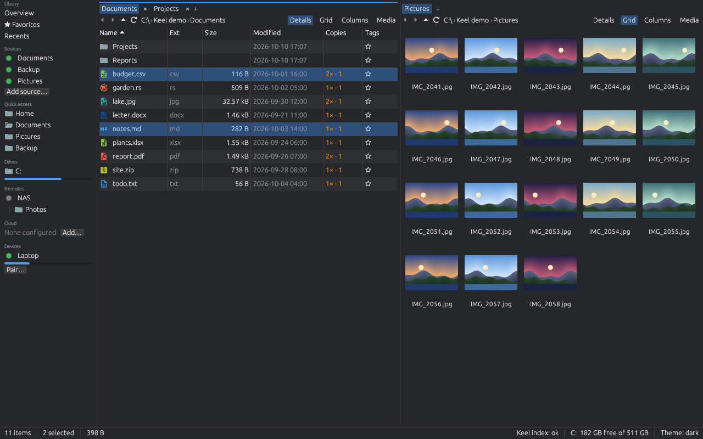
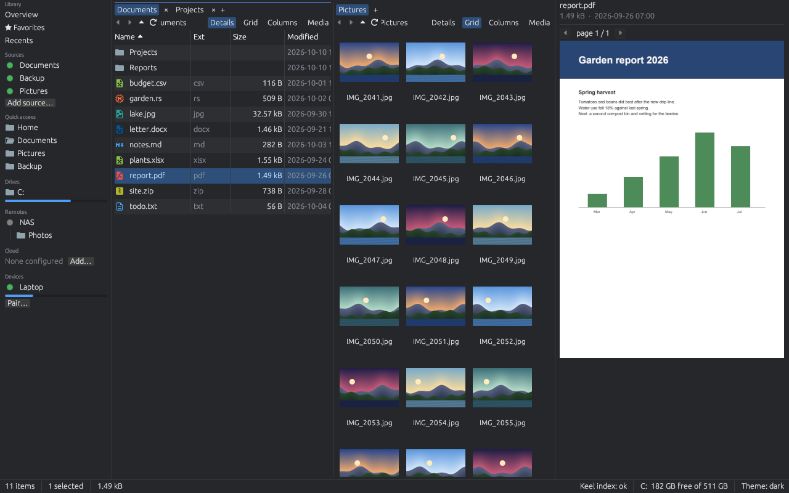
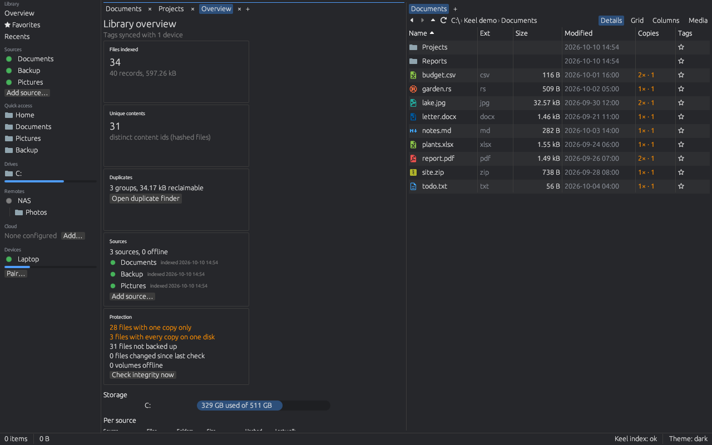

# Keel

Keel is an open-source file manager for Windows, macOS and Linux, written in Rust (egui + wgpu). It has two panes with tabs, a preview panel for most kinds of files, fast search, archives that open like folders, SSH and cloud storage, and an optional library that indexes your folders, drives, servers and cloud accounts, so you can search them while they are offline, find duplicates and see which files have no second copy. It sends no telemetry. Windows 10/11 is the daily driver; the macOS and Linux builds come from the same code.

## Features

- **Two panes and tabs**, with Details, Grid, Columns and Media views, a breadcrumb path bar, filter-as-you-type and a command palette (Ctrl+Shift+P).
- **Previews** (F3) of code, text, Markdown, images, PDF pages, spreadsheets, Word, PowerPoint and OpenDocument files, and video frames.
- **Search** through Everything, Spotlight, `locate` or Keel's own index, and Ctrl+P to jump to any folder.
- **File operations** with progress, conflict prompts, the system clipboard and drag and drop; deletes go to the Recycle Bin or Trash.
- **Archives as folders**: zip, 7z, tar and rar; zip and jar archives can be edited in place.
- **A terminal pane** that follows the active folder.
- **SFTP remotes** (with `~/.ssh/config` and jump hosts) and **cloud accounts**: Google Drive, Dropbox, S3 and WebDAV.
- **The library**: an index of all your sources that works offline, with tags, favorites, a duplicate finder, protection counts, a drive inventory and a preview before every change.
- **A media view** for photos and videos, with a full-window viewer and video playback.
- **Devices**: pair your own computers, share folders, send files with Spacedrop and keep tags in sync.
- **Daemon, CLI and MCP**: the library from a terminal, over JSON-RPC, in a browser or on a phone, and for AI agents, always preview first.
- **Profiles, dark and light themes, and VS Code icon themes.**

The complete list is in [docs/features.md](docs/features.md).

## Install

The builds are not signed yet. The install scripts download the latest [release](https://github.com/Runitupshawty/keel/releases), check it against the release's `SHA256SUMS` and install for your user only (no admin, no root). Run them again to update.

**Windows** (PowerShell):

```powershell
irm https://raw.githubusercontent.com/Runitupshawty/keel/main/scripts/install.ps1 | iex
```

**macOS and Linux**:

```sh
curl -fsSL https://raw.githubusercontent.com/Runitupshawty/keel/main/scripts/install.sh | bash
```

**Debian and Ubuntu**: download `keel_<version>_amd64.deb` from Releases and `sudo apt install ./keel_*.deb`.

The zip and tarballs, uninstalling, SmartScreen and Gatekeeper on unsigned builds, the Linux runtime libraries and `fuse3`: see [Install](docs/getting-started.md#install) in the guide. Releases from before the checksum file need `-SkipVerify` (Windows) or `--skip-verify`.

## Start here

New to Keel? Read **[docs/getting-started.md](docs/getting-started.md)**: installing, the window and its keys, copying, renaming, searching, archives, remotes, the library, devices, where your settings live, and troubleshooting.

## Screenshots







These are rendered from the real UI on fixture data by `scripts/screenshots.sh`; the guide has more.

## Reference

The guide covers everyday use; these pages hold the details.

| Topic | Page |
| --- | --- |
| Every feature in one list, where settings are kept | [docs/features.md](docs/features.md) |
| Keyboard shortcuts, columns view and drop zone, archives, Recycle Bin and Trash, terminal, search without Everything, command line, profiles, icon themes | [docs/files.md](docs/files.md) |
| Library (sources, search syntax, hashing, resuming, the daemon), media view, protection | [docs/library.md](docs/library.md) |
| Remotes over SSH, `~/.ssh/config` and jump hosts | [docs/remotes.md](docs/remotes.md) |
| Devices and Spacedrop, library sync, web client, phones | [docs/devices.md](docs/devices.md) |
| Daemon, CLI and MCP, mounts | [docs/daemon.md](docs/daemon.md) |
| Every operation of the API, with schemas and examples | [docs/api.md](docs/api.md) |
| Measured speed on realistic data, what scales how, running the measurements | [docs/performance.md](docs/performance.md) |
| Changes and known limitations of each release | [CHANGELOG.md](CHANGELOG.md) |

### Phones

`keel-daemon --web` serves Keel's web client, which installs on a phone as an app with a phone layout and receives files from the phone's share sheet. Setting it up, reaching the daemon from the phone (same network, a tailnet or a TLS reverse proxy) and the token: [Web client](docs/devices.md#web-client) and [Phones](docs/devices.md#phones).

### Mounts

keel-daemon can serve a library source as a drive letter or folder that any program opens (`keel mount Photos K:`). The Linux release build includes the FUSE backend (install `fuse3`); on Windows and macOS build `keel-daemon` with `--features winfsp` or `--features fuse`. Without a backend or driver `keel mount` fails with error -32008. Details: [Mounts](docs/daemon.md#mounts).

### Cloud accounts: bring your own client id

Google Drive and Dropbox sign-in uses OAuth with PKCE and a loopback redirect (`http://127.0.0.1:<port>/`). Keel ships no OAuth client ids: `assets/cloud-clients.toml` holds placeholders. Register your own free app (a Google Cloud "Desktop app" OAuth client with the Drive API enabled, or a Dropbox scoped app with redirect URI `http://127.0.0.1`) and enter its client id per account, or replace the placeholders in that file before building; the file explains each step. WebDAV (Nextcloud, ownCloud, Synology, Apache `mod_dav`, any `https://host/path/` collection URL) needs no client id: Settings → Cloud → Add account → WebDAV takes the address (for Nextcloud `https://host/remote.php/dav/files/<user>/`), user name, password (use an app password where the server offers one) and an optional root folder, and **Test connection** lists the root before you save. `https://` is required unless you tick the explicit plain-`http://` box; `webdav://` addresses are refused. Deletes on WebDAV are permanent unless the server has its own trash, and uploads are held in memory (limit 1 GiB per file). Tokens, S3 keys and WebDAV passwords are kept in the OS keychain, never in `config.toml`.

**Storage and links.** Hover over a Google Drive or Dropbox account in the sidebar, or open Settings → Cloud, to see its storage ("12.3 GB of 15 GB used"); Keel asks the service in the background and keeps the answer for 10 minutes (**Refresh** in Settings → Cloud asks again). S3 and WebDAV report no quota. Right-click a cloud file and choose **Copy link** to put a link on the clipboard:

- **Google Drive**: the file's own link. Sharing is not changed, so it opens only for people who already have access (share the file on drive.google.com to widen that).
- **Dropbox**: an existing shared link of the file or folder; when there is none Keel asks "Create a link anyone can open?" and makes one with Dropbox's default settings.
- **S3**: after you confirm, a presigned download link that anyone holding it can use for 1 hour; it cannot be withdrawn earlier (short of replacing the keys). Files only.

WebDAV accounts and local files have no Copy link.

Limits and requirements:

- Account ids are lowercase (`[a-z0-9_-]`), because Windows Credential Manager ignores case.
- Uploads to Google Drive, Dropbox and S3 have no size cap: a file over 8 MiB goes in 8 MiB chunks through the service's upload session (Drive resumable upload, Dropbox upload session, S3 multipart upload; S3 allows 10,000 parts, so an object can be up to about 78 GiB), each chunk retried on its own, and a Drive or Dropbox upload carries on from what the service holds after a dropped connection. At most one chunk is held in memory, and the job's byte count moves as the chunks go up (it can run up to one chunk ahead of what has been sent). A failed S3 upload is aborted; an unfinished Drive or Dropbox session expires on its own after about a week. Cancelling the job stops the request on the wire at once; the job's error names the file, how much had been sent and what became of the partial upload.
- Google Docs, Sheets and other Drive-native files, and Drive shortcuts, have no bytes to download; they are not listed, so copying a folder skips them.
- A folder shows at most 50,000 entries.
- HTTPS uses rustls with the pure-Rust graviola crypto and the operating system's certificate store. Graviola needs an x86-64 CPU with AES, AVX2, ADX and BMI2 (most made since about 2014) or a 64-bit ARM CPU with AES, PMULL and SHA-2 (Apple silicon, Raspberry Pi 5); on other CPUs adding or opening a cloud account fails with "cloud accounts need a CPU with ...".
- If a sign-in is revoked, the account stops making requests and asks to sign in again.
- Keep `reqsign_core=warn` in any debug log filter (`keel_vfs::cloud::LOG_FILTER_HINT`): S3 keys are redacted, but the signing library logs credential providers at debug level.
- Cloud support is `keel-vfs`'s default `cloud` feature; build without it to leave out opendal, reqwest and rustls.

## Build from source

Install stable Rust with [rustup](https://rustup.rs). CI builds and tests on Windows, macOS and Linux.

**Windows**: install the Visual Studio Build Tools (C++ workload), then:

```powershell
pwsh scripts/fetch-deps.ps1
cargo build --release
```

**macOS**:

```sh
scripts/fetch-deps.sh
cargo build --release
```

**Linux**:

```sh
sudo apt-get install libgtk-3-dev libxkbcommon-dev libwayland-dev libasound2-dev
scripts/fetch-deps.sh
cargo build --release
```

`fetch-deps` downloads the runtime libraries (pdfium, and the Everything SDK DLL on Windows) into `target/deps/`; the build copies them next to the binary. Run the tests with `cargo test --workspace`. The app icon is generated from `assets/keel.svg` with `cargo run -p keel-app --example gen_icon`.

## Roadmap

Phases 1 to 9 are released: the usable core, archives and terminal, SFTP remotes, cloud storage, polish, the library, media and protection, devices with the daemon, CLI and MCP, and clients (the web client and phone app, mounts, Share → Keel). 0.10.0 and 0.11.0 shipped the Phase 9 follow-ups (the desktop app attaching to a running keel-daemon, Mount… in the sidebar, a Playwright run of the web client in CI) and video playback with sound in the media viewer.

What is next, from the known limitations still open:

- Signed and notarized builds, and Windows and macOS release builds with a mount backend (Windows: blocked by winfsp-rs being GPL-3.0; macOS: macFUSE cannot be installed on the build machines).
- Runs on real macOS and Linux hardware of what so far only runs in CI (terminal, SFTP, single instance, the global hotkey, Spotlight and `locate` search), and of WSL shells.
- Drag-out to other apps on macOS and Linux, and the native Windows shell context menu.
- SFTP: copies between two hosts without passing through this PC (`ProxyCommand` stays unsupported on purpose).
- Library and protection: disks without a serial or cloned with one (their failure domain is set by hand today).

Known limitations of each release are listed in [CHANGELOG.md](CHANGELOG.md).

## Contributing

Bug reports and pull requests are welcome; see [CONTRIBUTING.md](CONTRIBUTING.md), which also explains how to make the screenshots again. Run `cargo fmt --all --check`, `cargo clippy --all-targets -- -D warnings` and `cargo test --workspace` before opening a pull request. CI also runs `cargo deny check` (licenses, advisories, banned crates, sources; policy in `deny.toml`; install with `cargo install cargo-deny --locked`). If it fails, first update the offending dependency; if that is not possible, add the minimum `deny.toml` entry (an `ignore` with the advisory id, or a license in `allow`) with a one-line reason and the crate that needs it, and mention it in the pull request.

The web client also has a browser test (CI job `web-e2e`, not part of the required check): `tests/web-e2e` starts `keel-daemon --web` on a fixture library in a temp folder and drives the page with Playwright (Chromium only). To run it locally you need Node 22 or newer: `bash scripts/build-web.sh --features e2e && cargo build -p keel-daemon` (the test drives the page through the bundle's `window.__keel` hook, which only that build has and only with `?e2e=1`; build again without `--features e2e` for normal use), then once `cd tests/web-e2e && npm ci && npx playwright install chromium`, then `bash tests/web-e2e/run.sh` (`DAEMON=path` picks another keel-daemon). It uses a throwaway profile and port 7421, never your own Keel configuration; screenshots of each step land in `tests/web-e2e/out/`.

## License

Licensed under either the MIT License or the Apache License 2.0, at your option. Third-party components: see [THIRD_PARTY.md](THIRD_PARTY.md).
