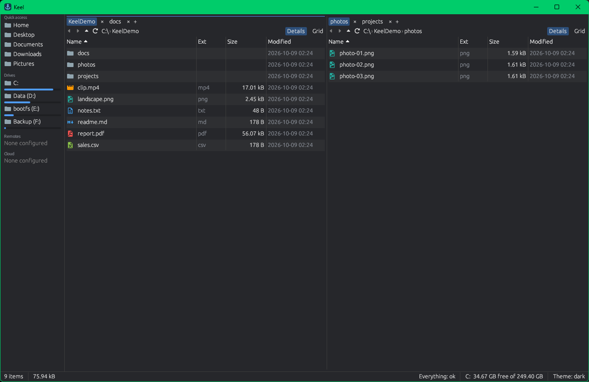
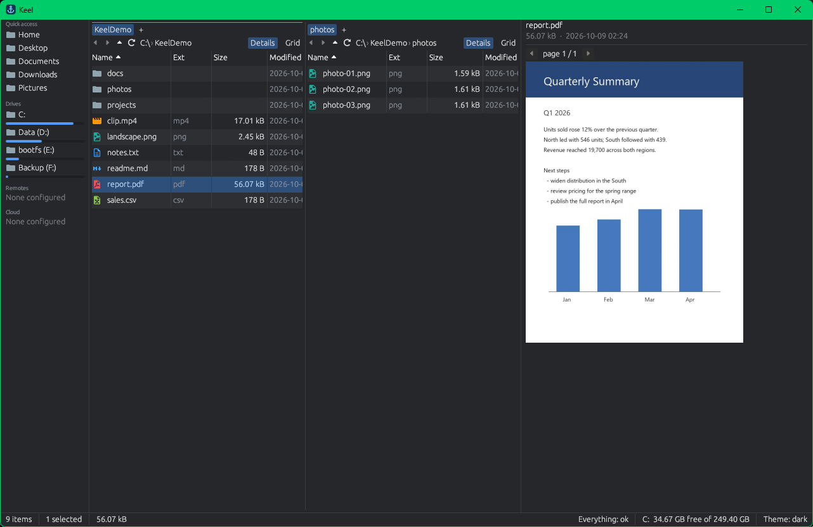

# Keel

Keel is an open-source, cross-platform file manager written in Rust (egui + wgpu): two panes, tabs, fast search and rich previews, with no telemetry. Windows 10/11 is the daily driver; macOS and Linux builds come from the same code.





## What works (v0.11.0)

- **Dual pane and tabs**: two panes (Ctrl+Shift+D for one), any number of tabs per pane (drag to reorder), back/forward history, breadcrumb or editable path (Ctrl+L), details and grid views with thumbnails, sidebar with home folders and drives.
- **Search**: Ctrl+F opens a search tab. Windows uses [Everything](https://www.voidtools.com/) when it is running and otherwise Keel's own index (see [Search without Everything](#search-without-everything)), macOS uses Spotlight (`mdfind`), Linux uses `plocate`/`locate` when installed, otherwise a folder walk. Ctrl+Enter opens a result's folder with the file selected.
- **Fuzzy folder jump**: Ctrl+P matches against every folder the search index knows (or a walk of your home folder).
- **Command palette**: Ctrl+Shift+P lists every action by name with its shortcut.
- **Filter by typing**: start typing in a list to filter it; Esc clears.
- **Previews**: F3 shows or hides the preview panel (there is no Ctrl+Shift+V shortcut). Code with syntax highlighting, text, Markdown, images (PNG, JPEG, GIF, WebP, BMP, ICO, SVG), PDF pages (needs the pdfium library next to the binary: included in the release archives, or run `scripts/fetch-deps`), CSV/TSV and spreadsheets (xlsx, xls, xlsb), Word documents (docx, with headings, lists, tables and page breaks), PowerPoint slide text (pptx), OpenDocument text, spreadsheets and presentations (odt, ods, odp), video thumbnails (optional: needs `ffmpeg` on `PATH`), hex for anything else.
- **File operations**: copy, move, rename (F2; Ctrl+F2 renames many at once), new folder/file, and delete to the OS trash (never a permanent delete), with progress, cancel, and skip/overwrite/rename prompts on name clashes. Drag and drop between panes and from other apps.
- **System clipboard**: Ctrl+C / Ctrl+X / Ctrl+V exchange files with Explorer (including cut) and Finder / file managers on Linux (copy only for now).
- **Recycle Bin / Trash**: the sidebar's Recycle Bin (Windows) or Trash (Linux) entry opens your bin as a folder showing where each item came from and when it was deleted. Right-click to Restore, Delete permanently or Empty; both deletes ask first. See [Recycle Bin and Trash](#recycle-bin-and-trash).
- **Archives as folders**: zip, 7z, tar (gz, bz2, xz, zst) and rar open like directories, nested ones too; entries of a zip can be deleted, renamed, moved and added. See [Archives](#archives).
- **Embedded terminal**: a shell pane under the file panes that follows the active folder. See [Terminal](#terminal).
- **SFTP remotes**: browse, preview and copy to and from any SSH host. See [Remotes over SSH](#remotes-over-ssh).
- **Cloud accounts** (Google Drive, Dropbox, S3-compatible buckets, WebDAV) as folders; Drive and Dropbox sign in with your own OAuth client id, S3 and WebDAV with keys or a password; all secrets stay in the OS keychain; storage quota (Drive, Dropbox) and Copy link. See [Cloud accounts](#cloud-accounts-bring-your-own-client-id).
- **Columns view**: Miller columns per pane, plus a **drop zone** strip that carries files across navigation. See [Columns view and drop zone](#columns-view-and-drop-zone).
- **Profiles**: separate settings and sessions you can switch at runtime. See [Profiles](#profiles).
- **Icon themes**: install VS Code icon themes from the Marketplace. See [Icon themes](#icon-themes).
- **Command line, single instance and a global hotkey**: `keel <folder>` opens in the running window; Ctrl+Shift+Alt+K brings Keel forward. See [Command line](#command-line).
- **Drag out** of Keel onto other apps (Windows).
- **Own search index** on Windows, so search works without Everything. See [Search without Everything](#search-without-everything).
- **Library**: an index of every file across your folders, drives, SSH hosts and cloud accounts that keeps working when a drive is unplugged. Cross-source search, tags, favorites, saved views, a duplicate finder, and a preview before every copy, move or delete. See [Library](#library).
- **Media view**: a photo and video grid that scrolls 129,000 items smoothly, video scrubbing on hover, date headers, and a full-window viewer with zoom, an info panel and video playback with sound. See [Media view](#media-view).
- **Protection**: how many copies of each file exist and on how many physical disks or accounts, backup state, integrity checks and a drive inventory, with "last copy" warnings before a delete. See [Protection](#protection).
- **Devices and Spacedrop**: pair your own machines with a short code or QR code, browse their shared folders as `node://` sources and send files with resumable, verified Spacedrop. See [Devices and Spacedrop](#devices-and-spacedrop).
- **Daemon, CLI and MCP**: `keel-daemon` serves the library over JSON-RPC, `keel search`, `keel plan` and friends work from a terminal, and `keel mcp` lets Claude Code, Codex and other agents use the library with a preview before every change. The window attaches to a running daemon, so all of them share one library while it is open. See [Daemon, CLI and MCP](#daemon-cli-and-mcp).
- **Open, open with, reveal** in the system file manager, open a terminal in the current folder.
- **Themes**: dark and light (a TOML file in `<config>/themes/dark.toml` or `light.toml` overrides the built-in colours). One built-in file icon theme.
- **Settings** (Ctrl+,): theme, hidden files, dual pane, preview panel, maximum preview size. Open tabs are restored on the next start; a local folder that was deleted falls back to your home folder, while a tab on an unreachable network share stays open and shows the error. A `config.toml` or `session.json` that cannot be read is kept as `config.toml.bad` / `session.json.bad`.
- **Crash safety**: a bug inside the UI is written to `crash.log`, the panes are reset and Keel keeps running.

Settings live in `%APPDATA%\Keel` (Windows), `~/Library/Application Support/Keel` (macOS) or `~/.config/keel` (Linux); session and `crash.log` in `%LOCALAPPDATA%\Keel`, `~/Library/Caches/Keel` or `~/.cache/keel`. Set `KEEL_CONFIG_DIR` to keep settings, session and `crash.log` in one folder instead (the window size and position that eframe saves in `app.ron` stay in eframe's own folder).

## Library

The library is an index of the files in your **sources** (a local folder or drive, an SSH host, a cloud account). It records name, size, dates and kind, follows files across renames, and keeps the last indexed state of each source so you can still browse, search and plan operations on a drive that is unplugged. It is additive: Keel works as before with the library off (Settings → Library).

**Add a source.** In the sidebar's Library section choose **Add source…** and pick a local folder, a configured remote or a cloud account. Indexing starts at once and runs in the background; the source shows a status dot. Local sources are watched live and fully re-checked every 6 hours. Remote and cloud sources are asked what changed every 2 minutes (Settings → Library → **Check remote sources every**, `[library] remote_poll_secs`) and also fully re-checked every 6 hours: Google Drive and Dropbox report their changes (Drive's `changes.list`, Dropbox's `list_folder/continue`), which are applied like a local folder's, without walking the source; on SFTP up to 2,000 indexed folders' modified times are read per check, in turn, and only the folders whose time moved are listed again (new, deleted and renamed files and new folders show up; a change inside an existing file waits for the 6-hour walk); an S3 bucket of up to 1,000 objects is walked only when its object count, size or newest modification changed. Bigger buckets and WebDAV accounts are walked every 5 minutes (or at the check interval, when that is longer). A source is walked at once when its service no longer accepts the saved position in its change feed or reports a change it cannot place, or when a check gets no answer (the walk shows it offline); a walk that fails is tried again after 2, 4, 8 and up to 30 minutes.

**Sidebar.** Overview (counts, storage, sources, a per-source table of files, folders, size, share hashed and last walk, running jobs, duplicates), Favorites (Ctrl+D toggles), Recents, Sources, Tags and saved Views. Sources open as `library://` tabs that work offline. Ctrl+Shift+T opens the tag picker; tags show as chips on rows. Search can use the Library as its backend.

**Where data lives.** Each source has its own SQLite store (with full-text search) in `<data dir>/library/<name>/`, where `<data dir>` is `%LOCALAPPDATA%\Keel` (Windows), `~/Library/Application Support/Keel` (macOS) or `~/.local/share/keel` (Linux). Set `KEEL_DATA_DIR` to use another folder. The library only changes your files through an operation you confirmed.

**Content hashing.** To find duplicates Keel computes BLAKE3 content ids lazily: a sample of the file first, and a full hash only when samples collide; files of 192 KiB or less are hashed whole. Hashing runs at idle priority. Settings → Library → Hashing chooses *idle only* (default), *pause on battery* (also runs while you work, but not on battery) or *off*. Files on SFTP sources are hashed too (**Remote hashing**, on by default): each is downloaded once through the source's connection, one file at a time, and gets the same content id as a local copy of the same bytes, so duplicates and copies between this PC and a file server are found. Cloud sources (Google Drive, Dropbox, S3, WebDAV) are hashed only when **Cloud hashing** is on (off by default: every file is downloaded, and downloads can cost egress fees). Remote files over the **Remote size cap** (1024 MiB by default) are left unhashed, and do not start a hash job after every poll. A remote host that is offline leaves its files unhashed until the next run; a remote file that cannot be read is tried again an hour later, then after 2, 4 and so on up to 24 hours, or as soon as it changes. Turning Remote or Cloud hashing off stops a running job's downloads at once. The remote settings are kept with the library: a window shows the library's own (a `keel` client's `hashing.set` included) and changes them only when you do. Keel never uses a service's own checksums (ETag, MD5, Dropbox's content hash) as content ids.

**Preview before you act.** Copy, move, delete and rename started from a library view first show a preview built from the index: what will change, plus warnings for the last copy of a file, a permanent delete on SFTP or S3, content that has not been hashed (unverified), and an offline source. Execution checks the plan again and stops if anything changed since the preview.

**Resuming.** A copy or move that stops before it ends (Keel or keel-daemon closed, the computer restarted, a crash) continues where it stopped the next time the library opens, and its log says "resumed at file N of M". The files it already placed are skipped without being written again, the file it was writing is continued from its partial copy when the target is a local folder or an SFTP host (cloud targets, and a partial copy that changed meanwhile, start that file again), and a placed file that someone changed in the meantime stops the job instead of being overwritten. A move deletes each source file only once its copy is complete and verified. Progress is recorded every 256 files or 4 MiB, so after a crash (rather than a close) files placed into a folder that existed before the copy, since that last record, get the conflict choice again.

**Duplicate finder.** Open it from the Overview or the command palette ("Find duplicates"). It lists groups of files with identical content across sources and the space you could reclaim; removing copies goes through the same preview.

**Search syntax.** Several terms must all match; results are ranked.

| Term | Meaning |
| --- | --- |
| `report` | name or path contains the word |
| `"annual report"` | exact phrase |
| `ext:pdf` | extension |
| `size:>1mb`, `size:<10kb` | size comparison |
| `dm:2026-10` | modified in that month (ranges and `today` work too) |
| `kind:image` | file kind (`file:`, `folder:`) |
| `camera:canon` | media: camera starts with the word (`camera:"canon eos"`) |
| `taken:2024`, `taken:2023-06..2023-08` | media: capture date (same dates as `dm:`; never the modified time) |
| `w:>4000`, `h:<=1080` | media: width or height in pixels (`size:` comparisons) |
| `duration:>30s`, `duration:<2m` | media: video length (`ms`, `s`, `m`, `h`) |
| `has:gps` | media: has a GPS position |
| `kind:photo` | media: images (not videos) with media metadata |
| `tag:taxes` | has the tag |
| `in:photos` | under a path or source |

Words that match no name or path also search camera and photo keywords, ranked below name hits. The media filters need the sidecar job to have run on the source.

**The window and the daemon share one library.** A library has one owner at a time. When the window opens the library it first looks for the profile's `keel-daemon`; if one runs, the window attaches to it and works through its API instead of opening the library itself, and the Overview (and Settings → Library) says *Connected to the daemon*. Everything goes through the daemon then: sources, `library://` tabs, search, tags, favorites and recents, the jobs panel with live progress, previews and file operations (the window's own preview dialog confirms each plan), duplicates, copies badges, the protection card and drive inventory, hashing, integrity checks and media thumbnails, and Devices (pairing, shares, Spacedrop and `node://` tabs use the daemon's device). `keel` subcommands, `keel mcp` and other windows keep working meanwhile. Closing the window leaves the daemon running (`keel daemon stop` ends it). Turn on Settings → Library → **Run the library in a background daemon** (off by default) to have the window start `keel-daemon --profile=<name>` itself when none runs; otherwise it opens the library in-process, as before. If the daemon stops while the window is attached, a banner offers **Reconnect** (starting it again) and **Open in this window**; until you choose, the library is read-only. Both wait (up to 15 s) for a stopping daemon to let go of the library, and the banner stays until the library is open again. While attached, the daemon runs the scheduled integrity checks with the window's settings.

**Mount… from the sidebar.** Right-click a source in the sidebar and choose **Mount…** (or **Mount this folder…** on a folder in a `library://` tab) to make it a drive letter or mount folder that any program can open, served by keel-daemon (see [Mounts](#mounts) for the backends). The dialog picks a free drive letter (K: to Z:) on Windows, or a folder (default `~/Keel Mounts/<label>`, made by the daemon when the mount runs) on Linux and macOS, and shows the folder it serves. **Mount** previews `mounts.add` through the daemon and asks you to confirm before anything is mounted. A mounted source shows a *mounted K:* badge and an **Unmount** entry in its context menu; mounts last until you unmount them or the daemon stops. Mounting needs the daemon: with the library open in this window, turn on **Run the library in a background daemon** first.

While attached: files are read from their real paths (the daemon runs on the same machine). The media view shows the daemon's thumbnails (`media.thumb`, 256 px for tiles, 1024 px for the viewer and big tiles): the daemon makes a missing one on demand, visible tiles first and at most four at a time for the window, and its sidecar jobs fill the rest ahead; both sizes are kept in a small cache under the window's cache folder by content. A file the daemon cannot answer for is decoded in the window, and video strips and photo metadata (date headers, the viewer's info panel) are still made by the window. Your input reaches the daemon (`activity.note`), so *idle only* hashing and integrity checks pause while you work, as in-process, and sidecar jobs for a second after each input. Settings → Devices is written to the daemon as you change it: its device name, inbox (only when you set one: otherwise the daemon's own, `<data dir>/inbox`, so drops land in the same folder whether or not a window is open) and always-accept list change at once; relays only when the daemon starts again (it reads `[devices] relay` then). Switching to another library needs the daemon stopped first.

Limits: hashing skips cloud sources unless Cloud hashing is on, and remote files over the size cap; remote and cloud sources are polled rather than watched.

## Media view

Click **Media** in a pane's toolbar to see a folder as square tiles. S, M and L (or Ctrl+wheel) change the tile size; **Dates** groups tiles under the day each photo was taken (the modified date when a file has no capture time). Videos show a strip of 20 frames: move the pointer across a tile to scrub; until the strip is made the video's thumbnail stands in.

Thumbnails come from sidecars: small WebP files and a `meta.json` (dimensions, orientation, capture time, camera, lens, GPS, duration, rating, keywords) kept by content, so a moved or copied file keeps them. With the library on, the sidecar job makes them for every local source at idle priority (it pauses while you use the app and on battery) under a 10 GiB budget; with it off, the grid makes them on demand in a 2 GiB cache under the cache folder. Attached to keel-daemon, the grid shows the daemon's sidecars (see [Library](#library)). Video sidecars need `ffmpeg` on `PATH`. A file that cannot be read is shown with its icon and not tried again until it changes; a tool that runs out of time is tried again later (a video strip after 7 days or when the file changes; **Retry strip** in the viewer's **⋯** menu tries at once).

**Viewer.** Space or Enter opens the selected photo or video full-window: the 1024 px thumbnail at once, then the full image (decoded in the background, at most twice the screen size). Left/Right, Home/End move through the folder's media files; mouse wheel, `+` and `-` zoom (drag to pan), `0` fits and `1` shows 100 %; `I` shows the info panel; `F` toggles Favorite; Esc (or Space on a photo) closes.

**Video playback.** A video plays in the viewer with sound: Space or **Play** plays and pauses, a click on the progress bar or on a strip frame seeks there, Up/Down change the volume, `M` (or the volume button) mutes and `L` loops; the bar shows the elapsed and total time. Playback uses `ffmpeg` and `ffprobe` from `PATH` (two `ffmpeg` processes per position, one for the picture at the viewer's size, at most 1920 px, and one for the sound; both stop when you seek, move on or close) and plays through the default sound output, which is released while the video is paused; without a sound device the video plays silently. A video on a remote, cloud or device location is downloaded once first (the viewer shows "Downloading…" with the progress when the location reports it; a seek meanwhile waits for it, and moving on or closing cancels it). Enter, or **Open**, plays the file in the system player. Without `ffmpeg`, or when it cannot read the file, the viewer shows still frames (click a strip frame to show it) and Play opens the system player.

## Protection

With the library on, Keel tells you how safe your files are. Every source sits on a **volume** (a partition, a share, a cloud account, an SSH host) and every volume in a **failure domain**: the physical disk behind it (two partitions of one disk, or the logical volumes of one LVM disk, are one domain), the server of a share, the SSH host (two sources on one host are one domain, never the same domain as this PC), or the cloud account. Two copies in one domain are one failure away from none.

**Overview → Protection** shows how many files are not checked yet (no content hash: whether they have other copies is unknown), have one copy only, have every copy in one failure domain, are not backed up, or changed since their last integrity check, and how many volumes are offline. The counts follow changes made outside Keel: 5 s after the last change the watcher applied, they are recounted in the background (one recount per burst), and the card and the Copies badges refresh, attached to the daemon too. Hover over a number to see how it is computed. The details view's **Copies** column shows copies and domains per file, with every location on hover.

**Drive inventory.** The volume table lists every volume a source was seen on. Mark a drive **Archived** (on a shelf: its copies still count, flagged offline), **Lost** or **Retired** (its copies no longer count), and tick **Backup** for backup drives: a file is backed up when a copy sits on a backup volume in a second failure domain. The failure domain is editable: give two volumes the same name to make them one domain (a NAS reached by name and by address, a disk the detection splits), or clear the field to go back to the detected one.

**Warnings.** Delete and move previews warn when a file is the last copy of its content (copies seen through a junction, symlink or subst drive are the same file, not another copy), when the copies left would all share one failure domain, when they would all be on offline drives, and when a file is not hashed yet or its bytes drifted.

**Integrity.** Once a week (or **Check integrity now**) Keel re-hashes a sample of hashed files (1 % by default, Settings → Library) and marks *drift*: bytes that changed while size and times did not, as with bit rot or a tool that restores timestamps.

## Devices and Spacedrop

Keel can talk directly to your other computers. There is no account and no server of ours: devices connect peer to peer over an encrypted link ([iroh](https://www.iroh.computer/)), using iroh's public relay servers only when a direct path is not possible. Devices are off until you turn them on in Settings → Devices; that creates this device's identity, kept in the OS keychain. (A configuration saved by an earlier 0.8 build, while Devices were on by default, is switched off once; turn them on again if you want them.) There you also set this device's name, the Spacedrop inbox folder (default `Downloads/Keel Drops`, or `<data dir>/inbox` without a Downloads folder; attached to keel-daemon, the daemon's `<data dir>/inbox` unless you set one) and which devices may send without asking.

**Pair two devices.**

1. On one device open the sidebar's **Devices** section and choose **Pair a device… → Show code**. Keel shows a short code and a QR code (the QR carries the full ticket).
2. On the other device choose **Pair a device… → Enter code** and type the short code, or paste the ticket.
3. Both sides now list each other under Devices with a status dot (direct, relay or offline), the device's name and a storage bar.

A code works for 10 minutes and for one pairing; showing a new code replaces the old one. Treat it like a password until it is used. Pairing grants nothing: a freshly paired device can see only its name until you share something. Each pair of devices keeps one connection, whichever side opened it.

**Share folders (grants).** **Shares…** on a device row (or the Devices menu) lists what you give that device. Add a grant for a whole source or for one folder inside it, as **Read** or **Read-write**. A grant covers the folder and everything under it, and **Revoke** takes effect at once: running transfers from that device are cut off and later requests are refused. Sources that come from another device are never re-shared. Forgetting a device ends its shares and removes its folders from the library.

**Browse a remote source.** **Browse** on a device opens a tab at `node://<device>/<source>/...`, titled with the device's name (and "<device> / <source>" in a shared folder); the breadcrumb and the tab's hover use the names too, and a device you forgot shows its id. It behaves like any other folder: listing, preview, copy and drag between panes. Add a device's source as a library source to index it and search it like local files; the content ids it reports are its word only and never count as copies for delete warnings or duplicates. Writes to a device land in its shared folders whether they are local folders, SFTP hosts or cloud accounts, with the same grant and path checks; they are checked with BLAKE3 and published whole: into a local folder through a staging file renamed into place, into an SFTP or cloud source streamed through that host's connection to the server and placed by its own upload only after the check (a read-only or unreachable source refuses the write). Sharing a source whose deletes are permanent (SFTP, S3) read-write says so in the preview.

**Spacedrop.** Drag files or folders onto a device in the sidebar, or use **Send with Spacedrop…** in a file's context menu. The receiver sees an accept prompt with the names, count and size (Accept, Decline, or "always accept from this device"). Files travel in resumable 4 MiB pieces and show up as a job in the jobs panel; if the link drops or either app restarts, the transfer continues where it stopped. Pieces are staged in a `.keel-partial-<id>` folder inside the inbox, each file is verified against a BLAKE3 hash of the whole file, and only then moved into the inbox (a name clash becomes `name (1).ext`, never an overwrite). A drop that already arrived is remembered for an hour, so a sender that lost the last reply finishes without asking you again or sending a second copy. Cancel from the jobs panel; a prompt whose sender gave up or stopped asking goes away by itself.

**Security model, in plain words.**

- Only devices you paired can connect; everyone else is rejected before any request is read.
- Pairing reveals nothing about either device until the other side proves it knows the code, and the code works once.
- Every request is checked against your current grants, so a revoked or narrowed share applies even on an open connection. Paths that try to escape the shared folder (`..`, symlinks and junctions, Windows device names) are refused.
- Each peer is limited in connections and in concurrent requests, and a transfer that stalls is dropped after an idle timeout.
- Only one process may own a device store at a time, so grants cannot be changed behind the owner's back.
- Spacedrop needs your accept (or a standing auto-accept for that device), and the sender cannot choose where files land. One device can have at most 4 offers waiting (16 from all devices); more are refused as busy.
- Anyone holding a still-valid code can pair, so show it only to the person in front of you.

Limits: the short code is found through internet discovery, so on a network with no internet use the full ticket (the QR code does).

Developer note: `KEEL_NET_SECRET=memory` keeps the device identity in memory instead of the keychain, in the window, `keel-daemon` and the `keel` subcommands alike (tests and live checks; the device is new on every run and must pair again).

## Daemon, CLI and MCP

Everything the library can do is also a typed operation (53 of them: search, reading and previewing files, tags, favorites, recents, sources, jobs, duplicates, redundancy, protection, volumes, hashing, integrity and media jobs, copy, move, delete and rename plans, devices and their settings, shares, Spacedrop and mounts), reachable three ways: JSON-RPC from `keel-daemon`, `keel` subcommands, and an MCP server. The window uses the same operations when it is attached to the daemon. The reference with schemas and examples is [docs/api.md](docs/api.md).

**The preview-first rule.** A command that would change anything only returns a preview with a plan id and an input hash. `execute` applies exactly that plan; it refuses a wrong hash, a plan older than 10 minutes, and a plan whose sources changed in the meantime. Revoking a share (`shares.revoke`), noting an opened file (`recents.note`) and noting that you are working (`activity.note`, which pauses idle jobs for 5 s, sidecar jobs for 1 s) are the only things done directly; removing a source previews too, with what its index store holds (size, tags, favorites).

**Start the daemon.** `keel daemon start` (or run `keel-daemon`) opens the profile's library in the background, resumes its jobs and listens on a per-user local socket (a named pipe on Windows) that only your user can reach; `keel daemon status` and `keel daemon stop` do what they say, and there is one daemon per profile. `keel-daemon --ws 127.0.0.1:7420` also serves a WebSocket that requires a bearer token from a file in the config folder; `keel daemon rotate-token` replaces it (clients sign in again, sessions with the old token are closed). Devices follow the window's Settings → Devices switch (`[devices] enabled` in the profile's `config.toml`); the daemon's device serves your library's sources to the devices you granted them, as the window does. It reads the inbox, always-accept list and relays (`[devices] inbox`, `auto_accept`, `relay`) when it starts; `devices.settings_set` changes the name, inbox and always-accept list while it runs (an attached window does so from Settings → Devices), relays need a restart. The daemon keeps every source current like the window: local folders are watched live, the others are asked what changed every `[library] remote_poll_secs` (read when it starts) and walked as described under [Library](#library), and hashing follows each walk. The read operations never open Keel's configuration folder, and on Windows they open network (UNC) paths only inside your library sources. Without a daemon the subcommands open the library themselves, which works only while no Keel window holds it: start the daemon (or turn on Settings → Library → Run the library in a background daemon) and the window attaches to it instead, so the window, the subcommands and `keel mcp` all work at once. A daemon cannot start while a window has the library open in-process.

**One-liners.**

```sh
keel search "invoice ext:pdf" --max 20
keel tag add receipts ~/Docs/invoice-2026.pdf
keel plan move ~/Downloads/old.iso --to /mnt/archive | keel execute
keel plan delete ~/old-photos --json
keel devices
keel shares
keel sources add ~/Photos --label photos
keel daemon status
```

`--json` prints machine-readable output; `--profile NAME` selects a profile. Exit codes: 0 ok, 1 the operation failed, 2 usage. `keel tag`, `keel sources add|remove|index`, `keel mount` and `keel unmount` show their preview and apply it, since typing the command is the confirmation; `keel plan` stops at the preview. `keel mcp`, `keel execute`, `keel daemon` and `keel search` are always the subcommand, even in a folder with a subfolder of that name; write `keel ./mcp` to open such a folder.

**MCP for agents.** `keel mcp` is an MCP server on stdio with one tool per operation. For Claude Code:

```sh
claude mcp add keel --scope user -- keel mcp
```

or in a project's `.mcp.json`:

```json
{ "mcpServers": { "keel": { "command": "keel", "args": ["mcp"] } } }
```

For Codex, in `~/.codex/config.toml`:

```toml
[mcp_servers.keel]
command = "keel"
args = ["mcp"]
```

Use the full path to `keel` when it is not on `PATH`. Every mutating tool returns a preview and says to call `execute` with the plan id; tell your agent to show you the preview and run `execute` only after you agree. Read-only tools are marked as such.

Limits: a window that opened the library in-process keeps it until it closes or switches (Settings → Library → Run the library in a background daemon hands it over at once).

## Columns view and drop zone

Switch a pane to **Columns** from the view buttons in the pane header. Column 0 is the tab's folder; selecting a folder lists it in the next column, and selecting a file shows its preview in the last one. Left/Right move between columns, Enter opens a folder, Up or Backspace step back one column, and the column dividers can be dragged (widths are saved). All file actions work on the column you are in.

The **drop zone** is a strip above the status bar (Ctrl+Shift+Z shows or hides it; it also appears while you drag rows). Drop rows on it, or press Ctrl+Shift+S to stash the selection, then navigate anywhere and use **Paste here** (copy) or **Move here** into the active pane's folder; **Clear** empties it. Items that no longer exist are greyed and skipped, and moved items leave the strip only once they have really moved. The stash is saved with the session. "Reduce motion" in Settings → General turns off the animations.

## Profiles

A profile is a separate settings file and session (tabs, views, drop zone). Settings → Profiles creates one (a copy of the current settings), renames, deletes (to the OS trash) and switches; the command palette has "Switch profile: <name>". `keel --profile <name>` starts in a profile. Files: `<config>/profiles/<name>/config.toml`; the session is in the cache folder (`profiles/<name>/session.json`, or `session.json` for `default`).

## Icon themes

Settings → Icons lists the built-in icons and any installed theme, previews them and switches at runtime. To install one, type the extension id from the Visual Studio Marketplace (`publisher.name`, for example `PKief.material-icon-theme`) and press **Install from VS Code Marketplace…**. Keel downloads the package, shows its license and installs only after you press **I accept**. Themes are unpacked into your own config folder; Keel does not bundle or redistribute them.

Only SVG and PNG icons are used. An SVG that references anything outside itself (an `<image>`, `<script>` or `<foreignObject>`, an external `href` or `url()`, CSS `@import`, entities) is refused, both at install time and when the theme loads, and the number skipped is reported. This stops a theme from making Keel read local files or network shares. A theme holds at most 10,000 icons and 64 MB.

## Search without Everything

On Windows, when Everything is not running, Keel uses its own index: it reads the NTFS file table and keeps it current from the USN journal, and stores it in the cache folder. Queries are substring, glob (`*.pdf`) or `regex:`, with `folder:` and `in:<path>` filters.

Reading the whole file table needs administrator rights. Until you grant them Keel indexes your home folder (recursively) plus one level of each drive's root. Settings → General → **Index all drives (administrator)** asks Windows for elevation once, runs a helper (`keel --index-service`) that builds the full index, and hands the files back to your user; later starts need no elevation. The status bar names the active backend and shows its state. If Everything is running it is used instead and the button is greyed out.

On macOS and Linux Keel uses Spotlight (`mdfind`) or `plocate`/`locate` when they answer. Otherwise (and on Windows when nothing else works) it keeps its own **name index** of your home folder: a walk that skips hidden and git-ignored entries, saved in the cache folder (`<cache>/index/walk-<hash>.db`) so the next start is instant, and kept current from file system events in half-second batches. It is rebuilt when it is older than 7 days. The status bar says "indexing N files…" while it builds; searches work as soon as the first build finishes. Queries use the same syntax as above (substring, `*.pdf`, `regex:`, `folder:`, `in:<path>`).

## Command line

```
keel [FOLDER] [--new-window] [--profile NAME] [--search QUERY]
```

| Flag | Meaning |
| --- | --- |
| `FOLDER` | Open this folder (a file opens its folder with the file selected). Relative paths are resolved against where you ran `keel` |
| `--new-window` | Start a separate window even if Keel is already running |
| `--profile NAME` | Use the profile `NAME` ([Profiles](#profiles)) |
| `--search QUERY` | Open a search tab with this query (in FOLDER when given) |
| `--version`, `--help` | Print and exit |

By default there is one Keel per user and profile: a second `keel` hands its folder or search to the running window over a private pipe or socket that only your user can reach, brings it forward and exits. Turn this off with "Reuse the running window" in Settings → General. Settings → General also has the **global hotkey** (default Ctrl+Shift+Alt+K, empty to disable) that brings Keel forward from any app; it needs Ctrl, Alt or the Windows/Command key besides Shift, and Ctrl+Alt alone is avoided because it is AltGr on many layouts.

## Web client

`keel-daemon --web` serves Keel in a browser: browse sources (offline ones from the index), search, preview text, images and PDF pages, tag, rename and delete (preview first, then execute, exactly as in the window), follow jobs, see your devices and the Spacedrop inbox, send files to a device, and download files. Narrower than 700 px (a phone) it switches to a phone layout; it installs as an app (see Phones).

```sh
scripts/build-web.sh                # once, or scripts\build-web.ps1: builds crates/keel-web/dist
cargo build --release -p keel-daemon  # embeds that bundle
keel-daemon --web                   # http://127.0.0.1:7421/ (or --web 127.0.0.1:PORT)
```

`build-web` needs `rustup target add wasm32-unknown-unknown` and `wasm-bindgen-cli` of the `wasm-bindgen` version in Cargo.lock (the script prints how to install it). A daemon built without the bundle serves a page saying so.

**The token.** The first visit asks for the token in `daemon.token` in Keel's configuration folder on the daemon's machine (`%APPDATA%\Keel`, `~/Library/Application Support/Keel`, `~/.config/keel`, or `KEEL_CONFIG_DIR`). Tick **Remember on this device** to keep it in that browser's local storage; leave it off on a shared computer (it then lives only in the open tab). **Sign out** forgets it. The page sends the token as its first WebSocket message; it never goes in an address, and an address that carries one is refused and scrubbed from the address bar. Download links (`/file/...`) are one-time and expire after 60 seconds. Every page is served `no-store`, without referrers, under a same-origin content security policy; nothing is loaded from a CDN.

**From another machine.** `--web` binds loopback only. To reach it from your phone or laptop, bind your tailnet address with `--web <tailnet IP>:7421 --ws-allow-remote` (the daemon has no TLS of its own: a tailnet encrypts the link; elsewhere put it behind a TLS reverse proxy). The page answers only to the bound IP (loopback names on a loopback bind); add `--web-host <name>` for each host name you use to reach it (a tailnet name, or a reverse proxy's name). Anyone who can reach the port still needs the token, and until they sign in a connection is held to small messages and few connections at once. Keep loopback when you do not need it.

**Revoking access.** `keel daemon rotate-token` writes a new token: every browser and client signs in again, and sessions signed in with the old token are closed.

## Phones

The web client is an installable app (a PWA) with a phone layout: one pane (a list, or a media grid you pinch to resize), a bottom bar with **Browse**, **Search**, **Library** and **Devices**, the preview as a full-screen sheet (pinch to zoom, double-tap, swipe left or right for the next or previous file), long-press menus (Preview, Download, Send to device…, Delete…) and pull to refresh. Above 700 px it is the desktop layout. Pull to refresh is phone-only. Install it from the browser's menu (**Install app** / **Add to Home Screen**); the service worker keeps only the app shell, never your files or the daemon's answers, and loads the shell from the daemon whenever it can (the cached copy is for starting offline), so an updated daemon's client shows at the next start. Browsers install apps and run service workers only over **https** (or on localhost), so use the tailnet's certificate or a reverse proxy for the installed app; plain http still works as a page.

**Reaching the daemon from the phone.** Pick one:

- **Same network (LAN).** `keel-daemon --web <LAN IP of the PC>:7421 --ws-allow-remote`, then open `http://<that IP>:7421/` on the phone. Plain http: anyone on that network can read the traffic (the client warns you), so use it only at home, and prefer one of the next two.
- **Tailnet (Tailscale or similar).** `keel-daemon --web <tailnet IP>:7421 --ws-allow-remote --web-host <machine name>`, then open `http://<machine name>:7421/` from the phone on the same tailnet. The tailnet encrypts the link. For an installable app with https, put `tailscale serve` (or another TLS front) before it and add that name with `--web-host`.
- **Reverse proxy with TLS.** Keep the daemon on loopback (`keel-daemon --web`), and let a proxy (Caddy, nginx) with a certificate forward `https://<name>/` to `127.0.0.1:7421`, passing the `Host` header through and upgrading WebSockets on `/rpc`; start the daemon with `--web-host <name>` so it answers to that name.

Whenever the page comes over plain http from another machine, the client shows a warning that the token and files cross the network unencrypted.

**Share → Keel (Spacedrop from the phone).** With the app installed, the phone's share sheet lists Keel. Sharing photos or files posts them to the daemon, which parks them (at most 512 MiB, 100 files; an upload slower than 64 KiB/s is cut off) and opens the app; the share request cannot carry the token, so nothing more happens until the app asks "Open N shared files?" and, on **Open**, the signed-in app claims them, once, within 5 minutes (unclaimed shares are deleted). Then pick one paired device and **Send…**: the preview lists every file and its size, and **Execute** sends exactly those files with Spacedrop through the daemon to that device only. `spacedrop.send` sends only from library sources, the inbox and opened shares, never from Keel's configuration or data folder, and never follows a link inside a folder. Drops sent to the daemon's machine show in **Devices → Inbox** with Accept / Decline for waiting offers and **Download** for what arrived; they land in `[devices] inbox` of the profile's `config.toml` (default `<data dir>/inbox`), and devices listed in `[devices] auto_accept` skip the question. Devices must be on for the daemon (Settings → Devices).

## Keyboard shortcuts

| Key | Action |
| --- | --- |
| Ctrl+F2 | Bulk rename the selection (pattern, find/replace, case; Undo bulk rename in the palette) |
| Ctrl+, | Settings |
| Ctrl+Shift+T | Tag picker (library) |
| Ctrl+D | Toggle favorite (library) |
| Ctrl+Shift+O | Open with… (pick an app for the selected files) |
| Ctrl+Shift+Z | Show or hide the drop zone |
| Ctrl+Shift+S | Stash the selection in the drop zone |
| Ctrl+Shift+Alt+K | Global hotkey: bring Keel to the front (configurable) |

The full list, with your bindings, is in the command palette (Ctrl+Shift+P). Cmd replaces Ctrl on macOS.

## Archives

Press Enter or double-click a `.zip`, `.jar`, `.7z`, `.tar`, `.tar.gz`/`.tgz`, `.tar.bz2`, `.tar.xz`, `.tar.zst` or `.rar` file to open it as a folder (an archive inside an archive opens too). Up leaves the archive; preview works on the files inside. Right-click for **Extract here**, **Extract to folder**, **Extract to…**, **Add to "name.zip"** and **Compress to zip…** (pick Zip, 7z, Tar or Tar.gz in the dialog; the last choice is kept as `default_format` under `[archive]` in `config.toml`). Select an existing zip, 7z, tar or tar.gz together with other items from the same folder, or drop files on the archive row, to get **Add to "name"…** (asks first, runs as a cancellable job). Extraction asks before overwriting and refuses entries that would land outside the target folder. It also works into folders on SFTP hosts and cloud accounts: paste or drag entries there, extract an archive that lives there with Extract here or Extract to folder, or open the target folder in the other pane and pick **Extract to the other pane**. Each entry is streamed from the archive to the host and renamed into place once complete.

Inside a `.zip` or `.jar` on this computer you can work as in a folder: Delete, Rename (F2), Cut, Copy and Paste, drag and drop, New folder and New file, and paste or drop files and folders from anywhere (local, SFTP, cloud, another archive) into it. Each operation rewrites the archive once: the new archive is written beside the old one, synced and renamed over it, so a cancel, an error or a crash leaves the original as it was. Entries that stay are copied byte for byte (stored entries stay stored, password-protected entries are never decrypted, zip64 archives stay zip64); new files are deflated. Deleted entries go for good, and their folder stays. Large archives take as long as copying them once.

Everything else is read-only: 7z, tar and RAR archives, an archive inside an archive and an archive on an SFTP host or a cloud account (copy it to this computer first). You can extract from any of them and add files and folders to a zip, 7z, tar or tar.gz with Add to (entries of the same name are replaced; a 7z is re-encoded, a tar is streamed, and the old archive stays untouched until the new one is complete). RAR is read through libunrar and never written. Moving entries out of an archive is not supported: copy them, then delete. Password-protected entries are marked with a lock and cannot be previewed.

## Recycle Bin and Trash

Open **Recycle Bin** (Windows) or **Trash** (Linux, any freedesktop-compliant desktop) in the sidebar. Columns: Name, Original location, Size, Deleted on. **Restore** moves the selected items back to their original folders; if something with the same name is already there Keel stops and says so instead of overwriting it. **Delete permanently** and **Empty Recycle Bin** remove items for good and ask first (Empty shows the item count). The folder is read-only otherwise: nothing can be pasted, created or renamed in it, and a trashed folder cannot be browsed until it is restored. The preview panel shows trashed files where the system keeps them at a normal path (Windows `$R` files, Linux `files/`); otherwise it says there is no preview. macOS is not supported yet.

## Terminal

A terminal pane sits under the file panes. It starts in the active pane's folder and, with "Follow pane" on, changes directory when you navigate. Shells: PowerShell, Windows PowerShell, cmd and each installed WSL distribution on Windows; `$SHELL`, zsh or bash on macOS; `$SHELL`, bash or sh on Linux.

| Key | Action |
| --- | --- |
| ``Ctrl+` `` (backtick; Cmd on macOS) | Open, focus or hide the terminal. Hiding keeps the shell running; the x button ends it |
| `F6` or `Shift+Esc` | Leave the terminal and return to the file panes |
| `Esc` | Goes to the shell (vim, less, fzf) |
| Context menu, "Open terminal here" | Focus the terminal in the current folder |

"Follow pane" sends a `cd` only when the shell looks idle at a plain prompt; heavily customised prompts (oh-my-posh and similar) can prevent it.

## Remotes over SSH

Any host that runs an SSH server with SFTP enabled can be added under **Settings → Remotes** and then appears in the sidebar with a status dot (grey: disconnected, yellow: connecting, green: connected, red: failed). You can copy and move between local folders and remotes, and between two remotes (the data passes through your PC), preview files, and search names in a remote folder with Ctrl+F. Deleting on a remote asks first and is permanent: there is no trash.

### Add your Mac or NAS

1. On the Mac or NAS turn SSH on (macOS: System Settings → General → Sharing → Remote Login; NAS: its SSH or SFTP service). Check that `ssh user@host` works from a terminal.
2. In Keel open **Settings** (`Ctrl+,`) → **Remotes** → **Add**. Enter a label, the host name or IP address, the port (22 by default) and your user name.
3. Pick the authentication: **SSH agent** or **Key file** (for example one from `~/.ssh`, with its passphrase if it has one) are preferred; **Password** also works. Passwords and passphrases are stored in the OS keychain and never in `config.toml`.
4. Optionally set the initial folder and bookmarks. On a Mac, iCloud Drive is at `~/Library/Mobile Documents/com~apple~CloudDocs`.
5. Click the host in the sidebar. The first time, Keel shows the server's host-key fingerprint. Compare it with the one printed by `ssh-keyscan -t ed25519 host | ssh-keygen -lf -` (run it from a machine you trust) and choose Trust only if they match. Keel then records the key in `~/.ssh/known_hosts`.
6. Browse. Bookmarks are listed under the host; copy and paste or drag files between a remote pane and a local pane.

If a known host presents a different key, Keel refuses to connect and says so. Remove the old line from `~/.ssh/known_hosts` only after you know why the key changed.

### OpenSSH configuration and jump hosts

**Use ~/.ssh/config** is on by default for each remote. The Host field can then be an alias from your `~/.ssh/config`, and the editor shows what it resolves to under the field ("connects to host:port as user via jump", or "no ~/.ssh/config entry"). An empty User or key-file path and the default port 22 take the config's values; a user name, another port or a key-file path set in Keel win. With no user anywhere, your local account name is used, as `ssh` does. Turn the switch off to use only Keel's own settings.

What is read: `Host` blocks (`*` and `?` wildcards, several patterns per line, `!` exclusions), `keyword value` and `keyword=value` lines, quoted values, comments, and `Include` (relative to `~/.ssh`, wildcards in the file name, eight levels at most, missing files ignored). A byte-order mark at the start of a file (Windows PowerShell and older Notepad write one) is skipped. As in OpenSSH, a keyword OpenSSH does not know, such as a misspelt `Host`, is an error naming the alias and the file and line, in every block, unless an `IgnoreUnknown` line lists it; files over 1 MiB, and anything that is not a regular file, are refused. As in OpenSSH the first value found for a keyword wins and `IdentityFile` lines add up. Honoured: `HostName` (`%h`), `User`, `Port`, `IdentityFile` (`~`, `%d`, `%u`, `%h`, `%r`; tried in order when the key-file path is empty, before the default keys), `IdentitiesOnly` (with the SSH agent, only the agent keys whose `IdentityFile` has a matching `.pub` file are offered), `ProxyJump` and `ServerAliveInterval` (the keepalive; `0` turns it off).

`ProxyJump` takes a comma-separated route of `[user@]host[:port]` hops, each resolved through the same config (`none` turns it off). Keel signs in to the first hop, opens a forwarding channel through it to the next, and runs the next SSH session inside that channel, up to the remote itself; several hops chain. Each hop has its own host-key check and first-connection prompt, which names the hop, and its key is recorded in `~/.ssh/known_hosts` under the hop's resolved name and port. Jump hosts sign in like the remote (the SSH agent or the key file, with the hop's own `IdentityFile` entries when the key-file path is empty), but a remote's password is never sent to a jump host: a remote that uses a password reaches its jump hosts with the SSH agent's keys first, then the key files.

Not read: `Match` blocks (skipped; the editor shows a note with the file and line), `ProxyCommand` (refused with the alias and the file and line: Keel never runs programs named in the SSH configuration; use `ProxyJump`), `UserKnownHostsFile` (Keel keeps using `~/.ssh/known_hosts`), the system-wide configuration and every other OpenSSH option (they are accepted and ignored). The config is read again on each connection; disconnect and reconnect a connected remote to pick up a change.

### Security notes

Passwords and key passphrases live in the operating system's keychain (Windows Credential Manager, macOS Keychain, Secret Service on Linux) and are never written to `config.toml`, logs or toasts. Host keys are checked against your `~/.ssh/known_hosts`; an unknown key needs your explicit approval and a changed key is a hard error. Uploads are written to a temporary file next to the target and renamed only when complete, so a dropped connection does not leave a half-written file under the real name.

## Mounts

keel-daemon can serve a library source, or a folder in it, as a drive letter or mount folder that any program can open:

```
keel daemon start
keel mount Photos K: --subtree 2026     # Windows: a drive letter, or a folder that does not exist yet
keel mount Photos ~/mnt/photos          # Linux, macOS: an empty folder (made when missing)
keel mounts
keel unmount K:
```

The source is given by id or label (`keel sources`). Mounts belong to the daemon: they last until `keel unmount` or until the daemon stops (which unmounts them). The JSON-RPC and MCP operations are `mounts.list`, `mounts.add` and `mounts.remove` ([docs/api.md](docs/api.md)).

| | Windows | Linux | macOS |
| --- | --- | --- | --- |
| Backend | WinFsp | FUSE (through `fusermount3` or `fusermount`; no libfuse needed) | macFUSE |
| In the release build | yes | yes (zip, tarball and .deb) | no: build it yourself |
| Driver to install | [WinFsp](https://winfsp.dev) | `fuse3` (`sudo apt install fuse3`; the .deb recommends it) | [macFUSE](https://macfuse.github.io) |
| Build `keel-daemon` from source with | `--features winfsp` (needs LLVM/libclang for bindgen: `scripts/libclang.ps1`) | `--features fuse` | `--features fuse` (needs macFUSE and `pkg-config` at build time) |
| Target | `K:` or a new folder | empty folder (made when missing) | empty folder (made when missing) |

The Windows and Linux release builds of `keel-daemon` include the backend; install the driver to mount. Without the driver, `keel mount` fails with error -32008 and says what to install (the daemon itself starts and works as usual). The macOS release builds have no backend, because macFUSE (a kernel extension) cannot be installed on the build machines: build `keel-daemon` yourself with `--features fuse` after installing macFUSE (`cargo build --release -p keel-daemon --features fuse`). Note that the `winfsp` backend links winfsp-rs, which is GPL-3.0 licensed: the Windows release's `keel-daemon.exe` is therefore distributed under the GPL-3.0 (its license text is in `licenses/winfsp-rs/COPYING`, the source is this repository at the release's tag; see [THIRD_PARTY.md](THIRD_PARTY.md)). `keel.exe` does not include it and stays MIT or Apache-2.0.

What a mount does:

- **Listings** come from the source while it is online and from the library index while it is offline, so an unplugged drive or an unreachable server still shows its folders (files cannot be opened or changed until it is back).
- **Reads** are on demand: a program reading part of a file reads that range through Keel's VFS (local, SFTP, cloud), nothing is downloaded up front.
- **Writes** go to a `.keel-partial-…` staging file next to the target (for remote sources, a local spool uploaded on close) and replace the file atomically when the program closes it (before its `close` returns), so other programs never see a half-written file and an aborted or interrupted write leaves the old file (or none) in place. While a file is being written only the program writing it sees the new content: listings show the saved file, opening it elsewhere fails with a sharing violation (`EBUSY` on Linux and macOS) until it is closed, and a file being created does not show yet. If publishing fails, the program's close reports an error and the data is kept as `<name> (unsaved <date>).<ext>` (next to the file, or in `mount-spool` under the data folder for remote sources), a name Keel never cleans up; the daemon log says where. Unmounting drops writes still open (the files stay as they were).
- **Renames** of a file being written (or of a folder holding one, or a move to another folder) take effect at once: the write is published under the new name when the program closes the file. A file being created is not on the source until then, so renaming it only moves its write (over an existing file, that file is replaced when the new one is published). A file being written is never replaced by a rename.
- **Deletes** go to the trash for local sources, like Keel's own delete; on SFTP and S3 they are permanent (the `mounts.add` preview says so).
- **Attributes**: files and folders show the source's modified time (also as the access and change time); entries without one (S3 folders) take the time from the library index. While a file is being written, the system sees its written length and the time of its last write. Files of a read-only source show as read-only (`r--`, the Windows read-only attribute) and changes fail with "read-only file system" (`EROFS`). `df` and the drive's properties show the free and total space of the source's volume: the local disk, the SFTP server's filesystem (servers with the `statvfs@openssh.com` extension, as OpenSSH has), the cloud account's quota. Where Keel cannot tell, Linux and macOS show 0 and Windows a large placeholder (Explorer refuses to copy onto a drive with no free space).

Limits: file times, attributes and permissions are the source's and cannot be changed through the mount; a mount folder inside the folder it shows is refused; staging files and (on Windows) names Windows cannot show (`aux.txt`, `a:b`, names differing only in case on a case-sensitive source) are hidden; Windows refuses to rename a folder holding a file being written on a local source, as it does for any open file; on Windows only the current user, SYSTEM and Administrators can open the drive. SFTP and cloud sources mount the same way, through the profile's remotes and cloud accounts that keel-daemon registers.

## Install

The builds are not signed yet. The install scripts download the latest [release](https://github.com/Runitupshawty/keel/releases), check it against the release's `SHA256SUMS`, and install for your user only (no admin, no root).

**Windows** (PowerShell):

```powershell
irm https://raw.githubusercontent.com/Runitupshawty/keel/main/scripts/install.ps1 | iex
```

Installs to `%LOCALAPPDATA%\Programs\Keel`, adds a Start menu shortcut and an entry in Settings, Apps (uninstall there). For a Desktop shortcut or `keel` on your `PATH`, or to remove it again:

```powershell
$i = [scriptblock]::Create((irm https://raw.githubusercontent.com/Runitupshawty/keel/main/scripts/install.ps1))
& $i -Desktop -AddToPath
& $i -Uninstall
```

**macOS and Linux**:

```sh
curl -fsSL https://raw.githubusercontent.com/Runitupshawty/keel/main/scripts/install.sh | bash
```

Installs to `~/.local/share/keel` with `keel` in `~/.local/bin`; macOS also gets `~/Applications/Keel.app`, Linux a launcher entry. Remove with `... | bash -s -- --uninstall`.

**Debian and Ubuntu**: download `keel_<version>_amd64.deb` from Releases and `sudo apt install ./keel_*.deb`. The tarball needs the same libraries the package depends on: GTK 3, libxkbcommon and libxkbcommon-x11 (X11 sessions), libwayland-client and ALSA (`sudo apt install libgtk-3-0 libxkbcommon0 libxkbcommon-x11-0 libwayland-client0 libasound2`; on 24.04 the `t64` names).

Run the scripts again to update. Releases from before the checksum file need `-SkipVerify` (Windows) or `--skip-verify`.

### Manual install

Download the archive for your system from Releases.

**Windows** (`keel-<version>-win64.zip`): extract anywhere and run `keel.exe`; keep the DLLs next to it. No Visual C++ redistributable is needed (the runtime is linked statically). SmartScreen may warn about an unknown publisher (More info, Run anyway). Optional: install and start Everything for search.

**macOS** (`keel-<version>-macos-arm64.tar.gz` for Apple silicon, `-macos-x64` for Intel): extract, then clear the download quarantine and run it:

```sh
tar xzf keel-*-macos-*.tar.gz && cd keel-*-macos-*
xattr -dr com.apple.quarantine .
./keel
```

**Linux** (`keel-<version>-linux-x64.tar.gz`, x86-64, X11 or Wayland; glibc 2.35 or newer, e.g. Ubuntu 22.04, Debian 12):

```sh
tar xzf keel-*-linux-x64.tar.gz
mkdir -p ~/.local/opt ~/.local/bin ~/.local/share/applications ~/.local/share/icons/hicolor/256x256/apps
mv keel-*-linux-x64 ~/.local/opt/keel
ln -sf ~/.local/opt/keel/keel ~/.local/bin/keel
cp ~/.local/opt/keel/keel.desktop ~/.local/share/applications/
cp ~/.local/opt/keel/keel.png ~/.local/share/icons/hicolor/256x256/apps/
```

Optional everywhere: `ffmpeg` on `PATH` for video thumbnails. The release archives already contain pdfium for PDF previews.

## Build from source

Install stable Rust with [rustup](https://rustup.rs). CI builds and tests on Windows, macOS and Linux.

**Windows**: install the Visual Studio Build Tools (C++ workload), then:

```powershell
pwsh scripts/fetch-deps.ps1
cargo build --release
```

**macOS**:

```sh
scripts/fetch-deps.sh
cargo build --release
```

**Linux**:

```sh
sudo apt-get install libgtk-3-dev libxkbcommon-dev libwayland-dev libasound2-dev
scripts/fetch-deps.sh
cargo build --release
```

`fetch-deps` downloads the runtime libraries (pdfium, and the Everything SDK DLL on Windows) into `target/deps/`; the build copies them next to the binary. Run the tests with `cargo test --workspace`. The app icon is generated from `assets/keel.svg` with `cargo run -p keel-app --example gen_icon`.

## Cloud accounts: bring your own client id

Google Drive and Dropbox sign-in uses OAuth with PKCE and a loopback redirect (`http://127.0.0.1:<port>/`). Keel ships no OAuth client ids: `assets/cloud-clients.toml` holds placeholders. Register your own free app (a Google Cloud "Desktop app" OAuth client with the Drive API enabled, or a Dropbox scoped app with redirect URI `http://127.0.0.1`) and enter its client id per account, or replace the placeholders in that file before building; the file explains each step. WebDAV (Nextcloud, ownCloud, Synology, Apache `mod_dav`, any `https://host/path/` collection URL) needs no client id: Settings → Cloud → Add account → WebDAV takes the address (for Nextcloud `https://host/remote.php/dav/files/<user>/`), user name, password (use an app password where the server offers one) and an optional root folder, and **Test connection** lists the root before you save. `https://` is required unless you tick the explicit plain-`http://` box; `webdav://` addresses are refused. Deletes on WebDAV are permanent unless the server has its own trash, and uploads are held in memory (limit 1 GiB per file). Tokens, S3 keys and WebDAV passwords are kept in the OS keychain, never in `config.toml`.

**Storage and links.** Hover over a Google Drive or Dropbox account in the sidebar, or open Settings → Cloud, to see its storage ("12.3 GB of 15 GB used"); Keel asks the service in the background and keeps the answer for 10 minutes (**Refresh** in Settings → Cloud asks again). S3 and WebDAV report no quota. Right-click a cloud file and choose **Copy link** to put a link on the clipboard:

- **Google Drive**: the file's own link. Sharing is not changed, so it opens only for people who already have access (share the file on drive.google.com to widen that).
- **Dropbox**: an existing shared link of the file or folder; when there is none Keel asks "Create a link anyone can open?" and makes one with Dropbox's default settings.
- **S3**: after you confirm, a presigned download link that anyone holding it can use for 1 hour; it cannot be withdrawn earlier (short of replacing the keys). Files only.

WebDAV accounts and local files have no Copy link.

Limits and requirements:

- Account ids are lowercase (`[a-z0-9_-]`), because Windows Credential Manager ignores case.
- Uploads to Google Drive, Dropbox and S3 have no size cap: a file over 8 MiB goes in 8 MiB chunks through the service's upload session (Drive resumable upload, Dropbox upload session, S3 multipart upload; S3 allows 10,000 parts, so an object can be up to about 78 GiB), each chunk retried on its own, and a Drive or Dropbox upload carries on from what the service holds after a dropped connection. At most one chunk is held in memory, and the job's byte count moves as the chunks go up (it can run up to one chunk ahead of what has been sent). A failed S3 upload is aborted; an unfinished Drive or Dropbox session expires on its own after about a week. Cancelling the job stops the request on the wire at once; the job's error names the file, how much had been sent and what became of the partial upload.
- Google Docs, Sheets and other Drive-native files, and Drive shortcuts, have no bytes to download; they are not listed, so copying a folder skips them.
- A folder shows at most 50,000 entries.
- HTTPS uses rustls with the pure-Rust graviola crypto and the operating system's certificate store. Graviola needs an x86-64 CPU with AES, AVX2, ADX and BMI2 (most made since about 2014) or a 64-bit ARM CPU with AES, PMULL and SHA-2 (Apple silicon, Raspberry Pi 5); on other CPUs adding or opening a cloud account fails with "cloud accounts need a CPU with ...".
- If a sign-in is revoked, the account stops making requests and asks to sign in again.
- Keep `reqsign_core=warn` in any debug log filter (`keel_vfs::cloud::LOG_FILTER_HINT`): S3 keys are redacted, but the signing library logs credential providers at debug level.
- Cloud support is `keel-vfs`'s default `cloud` feature; build without it to leave out opendal, reqwest and rustls.

## Roadmap

Phases 1 to 9 are released: the usable core, archives and terminal, SFTP remotes, cloud storage, polish, the library, media and protection, devices with the daemon, CLI and MCP, and clients (the web client and phone app, mounts, Share → Keel). 0.10.0 and 0.11.0 shipped the Phase 9 follow-ups (the desktop app attaching to a running keel-daemon, Mount… in the sidebar, a Playwright run of the web client in CI) and video playback with sound in the media viewer.

What is next, from the known limitations still open:

- Signed and notarized builds, and a macOS release build with a mount backend (macFUSE).
- Runs on real macOS and Linux hardware of what so far only runs in CI (terminal, SFTP, single instance, the global hotkey, Spotlight and `locate` search), and of WSL shells.
- Drag-out to other apps on macOS and Linux, the cut flag on the Linux clipboard, the Recycle Bin / Trash folder on macOS, and the native Windows shell context menu.
- SFTP: copies between two hosts without passing through this PC (`ProxyCommand` stays unsupported on purpose).
- Library and protection: disks without a serial or cloned with one (their failure domain is set by hand today).
- Devices: short-code pairing without internet discovery (the full ticket already works offline).

Known limitations of each release are listed in [CHANGELOG.md](CHANGELOG.md).

## Contributing

Bug reports and pull requests are welcome; see [CONTRIBUTING.md](CONTRIBUTING.md). Run `cargo fmt --all --check`, `cargo clippy --all-targets -- -D warnings` and `cargo test --workspace` before opening a pull request. CI also runs `cargo deny check` (licenses, advisories, banned crates, sources; policy in `deny.toml`; install with `cargo install cargo-deny --locked`). If it fails, first update the offending dependency; if that is not possible, add the minimum `deny.toml` entry (an `ignore` with the advisory id, or a license in `allow`) with a one-line reason and the crate that needs it, and mention it in the pull request.

The web client also has a browser test (CI job `web-e2e`, not part of the required check): `tests/web-e2e` starts `keel-daemon --web` on a fixture library in a temp folder and drives the page with Playwright (Chromium only). To run it locally you need Node 22 or newer: `bash scripts/build-web.sh --features e2e && cargo build -p keel-daemon` (the test drives the page through the bundle's `window.__keel` hook, which only that build has and only with `?e2e=1`; build again without `--features e2e` for normal use), then once `cd tests/web-e2e && npm ci && npx playwright install chromium`, then `bash tests/web-e2e/run.sh` (`DAEMON=path` picks another keel-daemon). It uses a throwaway profile and port 7421, never your own Keel configuration; screenshots of each step land in `tests/web-e2e/out/`.

## License

Licensed under either the MIT License or the Apache License 2.0, at your option. Third-party components: see [THIRD_PARTY.md](THIRD_PARTY.md).
