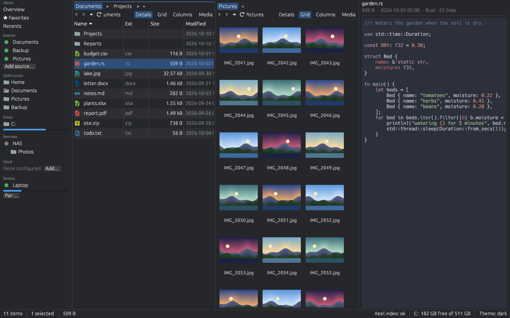
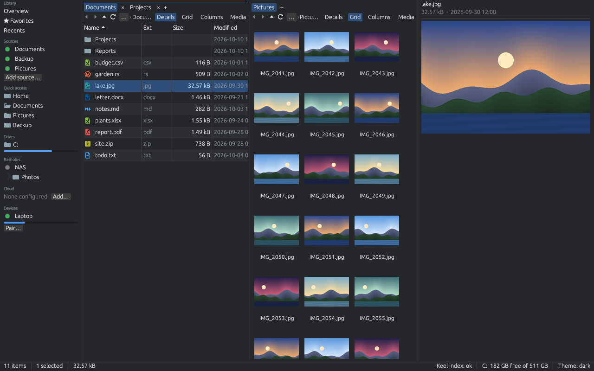
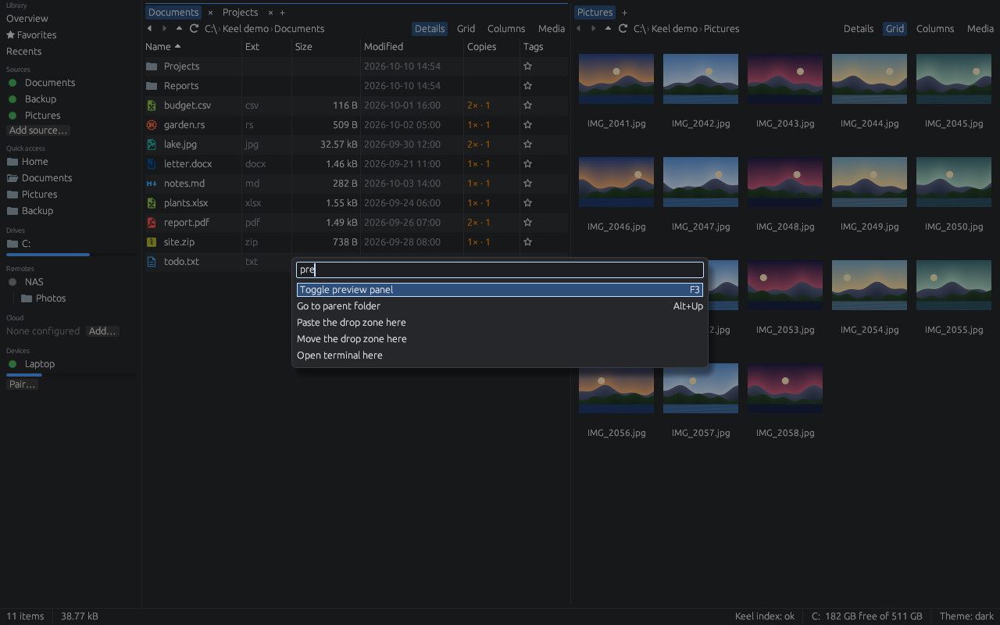
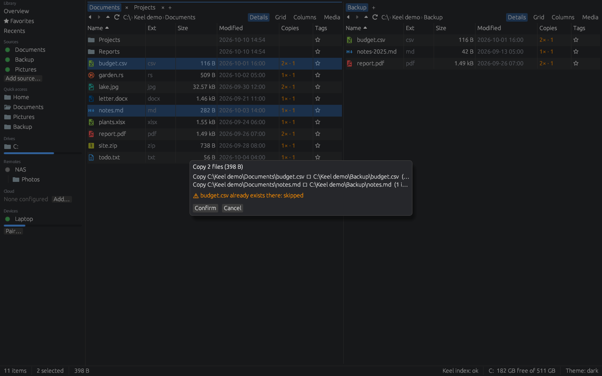
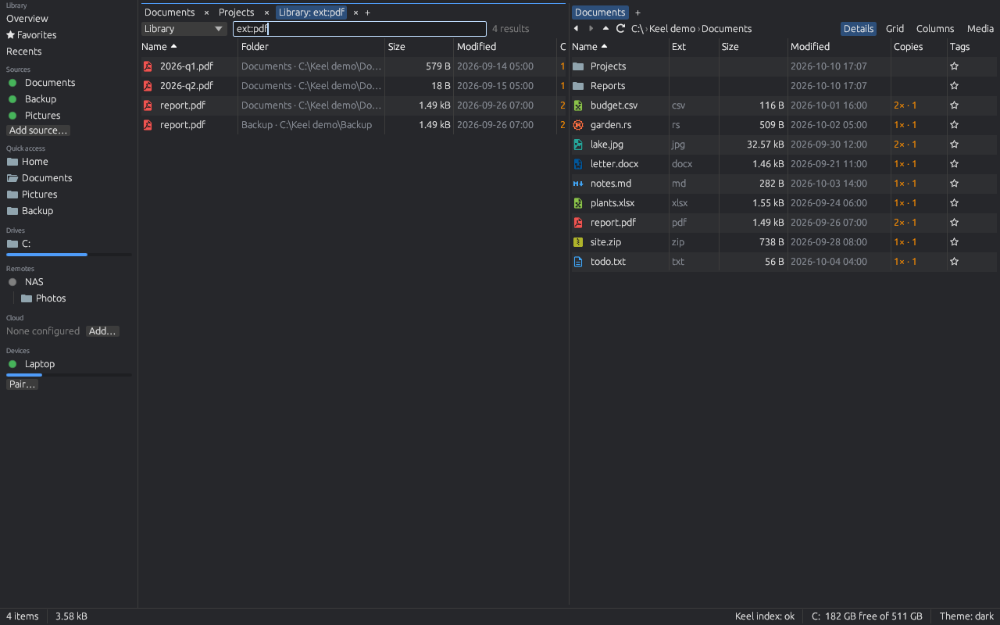
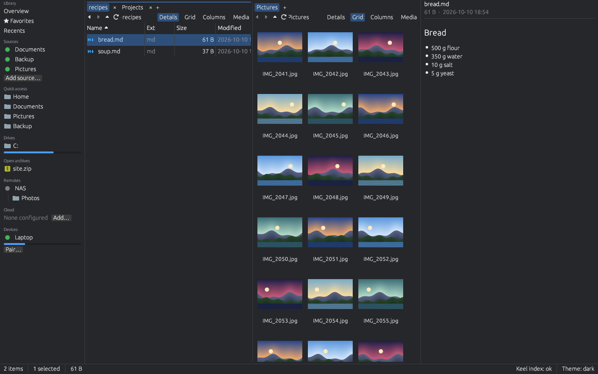
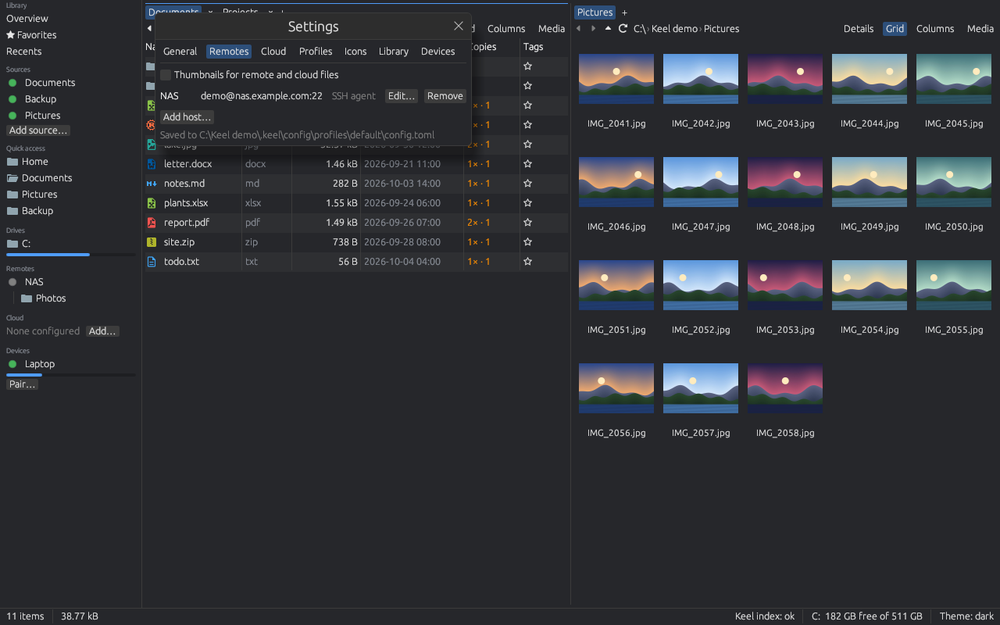
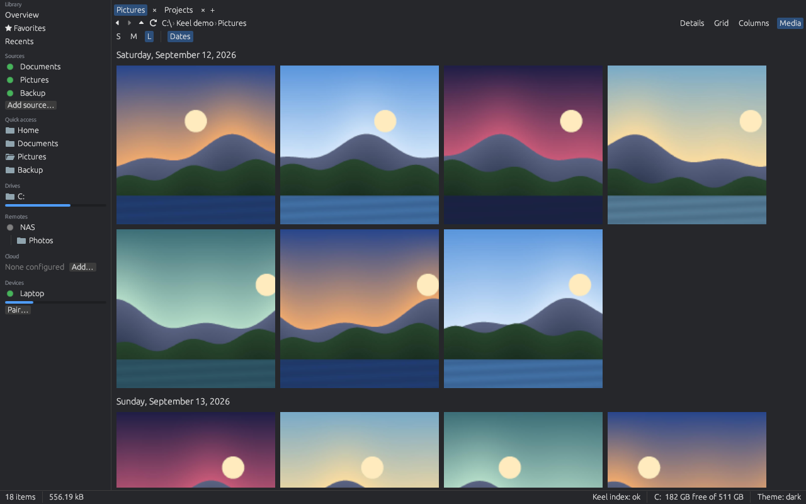
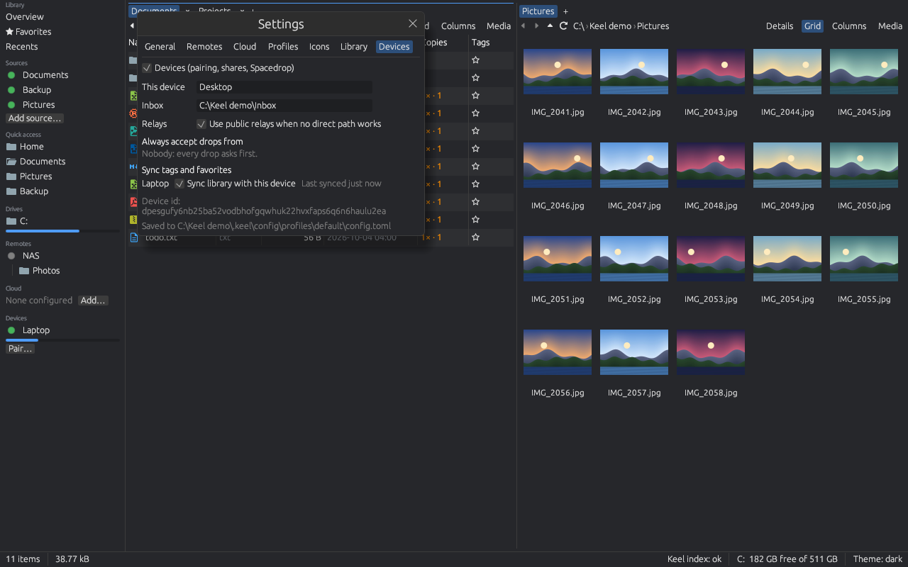

# Getting started with Keel

Keel is a file manager for Windows, macOS and Linux: two panes with tabs, a preview panel, fast search, archives that open like folders, SSH and cloud storage, and an optional library that indexes your drives so you can search them, find duplicates and see which files have no second copy. This guide takes you from installing it to the features you will use every day. The [README](../README.md) links the full reference for each part.

- [Install](#install)
- [First run](#first-run)
- [Everyday tasks](#everyday-tasks)
- [The library](#the-library)
- [Devices](#devices)
- [Daemon, CLI and MCP](#daemon-cli-and-mcp)
- [Profiles, themes and icon themes](#profiles-themes-and-icon-themes)
- [Where settings and data live](#where-settings-and-data-live)
- [Troubleshooting](#troubleshooting)
- [Getting help and contributing](#getting-help-and-contributing)

## Install

Keel's builds are not signed yet, so each system warns once before the first start; the sections below say what to click. The install scripts download the latest [release](https://github.com/Runitupshawty/keel/releases), check it against the release's `SHA256SUMS` and install for your user only (no administrator or root rights). Run a script again to update.

### Windows

In PowerShell:

```powershell
irm https://raw.githubusercontent.com/Runitupshawty/keel/main/scripts/install.ps1 | iex
```

Keel is installed to `%LOCALAPPDATA%\Programs\Keel`, with a Start menu shortcut and an entry in Settings → Apps, where you can uninstall it. For a Desktop shortcut and `keel` on your `PATH`, or to remove Keel again:

```powershell
$i = [scriptblock]::Create((irm https://raw.githubusercontent.com/Runitupshawty/keel/main/scripts/install.ps1))
& $i -Desktop -AddToPath
& $i -Uninstall
```

Without the script: download `keel-<version>-win64.zip` from Releases, extract it anywhere and run `keel.exe`. Keep the DLLs and `keel-daemon.exe` next to it. No Visual C++ redistributable is needed.

The first start may show a SmartScreen warning about an unknown publisher: choose **More info**, then **Run anyway**.

For the fastest search, install and start [Everything](https://www.voidtools.com/); Keel uses it whenever it runs and its own index otherwise.

### macOS

```sh
curl -fsSL https://raw.githubusercontent.com/Runitupshawty/keel/main/scripts/install.sh | bash
```

This installs to `~/.local/share/keel`, puts `keel` in `~/.local/bin` and adds `~/Applications/Keel.app`. Remove it with `... | bash -s -- --uninstall`.

Without the script: download `keel-<version>-macos-arm64.tar.gz` (Apple silicon) or `keel-<version>-macos-x64.tar.gz` (Intel), then:

```sh
tar xzf keel-*-macos-*.tar.gz && cd keel-*-macos-*
xattr -dr com.apple.quarantine .
./keel
```

Gatekeeper blocks unsigned apps that still carry the download quarantine. Either clear it with `xattr -dr com.apple.quarantine <folder or Keel.app>` as above, or open the app once by right-clicking (Control-clicking) it and choosing **Open**, then **Open** again in the dialog. On macOS 15 and later the dialog has no Open button: try to open Keel once, then choose **Open Anyway** in System Settings → Privacy & Security.

### Linux

On Debian and Ubuntu, download `keel_<version>_amd64.deb` from Releases and install it with its dependencies:

```sh
sudo apt install ./keel_*.deb
```

Or use the install script (installs to `~/.local/share/keel`, `keel` in `~/.local/bin` and a launcher entry; `--uninstall` removes it):

```sh
curl -fsSL https://raw.githubusercontent.com/Runitupshawty/keel/main/scripts/install.sh | bash
```

Or install the tarball `keel-<version>-linux-x64.tar.gz` by hand (x86-64, X11 or Wayland, glibc 2.35 or newer, for example Ubuntu 22.04 or Debian 12):

```sh
tar xzf keel-*-linux-x64.tar.gz
mkdir -p ~/.local/opt ~/.local/bin ~/.local/share/applications ~/.local/share/icons/hicolor/256x256/apps
mv keel-*-linux-x64 ~/.local/opt/keel
ln -sf ~/.local/opt/keel/keel ~/.local/bin/keel
cp ~/.local/opt/keel/keel.desktop ~/.local/share/applications/
cp ~/.local/opt/keel/keel.png ~/.local/share/icons/hicolor/256x256/apps/
```

The script and the tarball need the libraries the .deb depends on: GTK 3, libxkbcommon and libxkbcommon-x11 (for X11 sessions), libwayland-client and ALSA:

```sh
sudo apt install libgtk-3-0 libxkbcommon0 libxkbcommon-x11-0 libwayland-client0 libasound2
```

(On Ubuntu 24.04 some of these have `t64` names, such as `libgtk-3-0t64` and `libasound2t64`.) To mount library sources as folders (see [Daemon, CLI and MCP](#daemon-cli-and-mcp)) also install `fuse3`; the .deb recommends it.

### Optional everywhere

- `ffmpeg` on your `PATH`: video thumbnails, the frame strips in the media view and video playback with sound. Without it videos show their icon and open in the system player.
- PDF previews need pdfium, which the release archives already contain.

## First run


Keel opens on your home folder in both panes.

- **Sidebar** (left): the **Library** section (Overview, ★ Favorites, Recents, your sources, tags and saved views), then **Quick access** (Home, Desktop, Documents, Downloads, Pictures and the Recycle Bin or Trash), **Drives** with a bar showing how full each one is, **Open archives** while you browse inside one, **Remotes**, **Cloud** and **Devices**. A click opens the folder in the active pane, a middle-click opens it in a new tab.
- **Two panes**: click a pane, or press F6, to make it the active one. Ctrl+Shift+D switches between one and two panes.
- **Tabs**: Ctrl+T opens a tab, Ctrl+W closes it, drag tabs to reorder them. Your tabs are restored the next time Keel starts.
- **Path bar**: the arrows go back, forward and up (Alt+Left, Alt+Right, Alt+Up); click a part of the path to go there, or press Ctrl+L to type a path. Backspace goes to the parent folder.
- **Views**: the buttons at the right of each pane's header switch between **Details**, **Grid** (thumbnails), **Columns** and **Media** (photo and video tiles).
- **Filter**: start typing in a list to show only the names that match; Esc clears the filter.
- **Preview panel**: F3 shows or hides it. It previews code with syntax highlighting, text, Markdown, images, PDF pages, CSV and spreadsheets, Word, PowerPoint and OpenDocument files, video frames, and anything else as hex.
- **Status bar** (bottom): how many items the folder has, how many are selected and their size, the active filter, on Windows the search backend and its state, the free space of the drive, and **Theme**, which switches between dark and light.






**Command palette.** Ctrl+Shift+P lists every action by name with its shortcut; type a few letters to narrow it down and press Enter. When something is selected, the actions for the selection come first. If you forget a key, look here.



**The most useful keys** (Cmd replaces Ctrl on macOS):

| Key | Action |
| --- | --- |
| Enter | Open the file or folder |
| Alt+Up, Backspace | Parent folder |
| Alt+Left / Alt+Right | Back / forward |
| F6 | Switch pane |
| Ctrl+T / Ctrl+W | New tab / close tab |
| Ctrl+L | Type a path |
| Ctrl+F | Search |
| Ctrl+P | Jump to a folder by name |
| Ctrl+Shift+P | Command palette |
| F3 | Preview panel |
| F2 / Ctrl+F2 | Rename / bulk rename |
| Ctrl+C, Ctrl+X, Ctrl+V | Copy, cut, paste (also with other apps) |
| Del | Move to the Recycle Bin or Trash |
| Ctrl+Shift+N | New folder |
| Ctrl+H (Cmd+Shift+. on macOS) | Show or hide hidden files |
| Ctrl+` | Terminal pane |
| Ctrl+, | Settings |
| Ctrl+Shift+Alt+K | Bring Keel to the front from any app (Settings → General) |

## Everyday tasks

### Copy, move and delete

Copy with Ctrl+C and paste with Ctrl+V, or cut with Ctrl+X to move. This works with Explorer, Finder and the usual Linux file managers too. You can also drag files: onto the other pane to copy them, with Shift held to move them, onto a folder in the same pane to move them. The tooltip under the pointer says **Copy** or **Move** before you let go. Files dropped from other apps are copied.

Every copy and move runs as a job in the panel above the status bar, with its progress and a cancel button. When a name already exists in the target folder Keel asks once for the whole job: **Skip**, **Overwrite**, **Keep both** (the new file gets a numbered name) or **Cancel**.

When the files are in a library source (see [The library](#the-library)), Keel first shows a preview built from the index: what will be copied, moved or deleted, and warnings such as a file that already exists in the target, the last copy of a file's content, or a source that is offline. Nothing happens until you press **Confirm**, and the job checks the plan again before it starts.



**Delete** (Del, or Delete in the context menu) asks first and then moves the items to the Recycle Bin (Windows) or Trash (macOS, Linux); Keel never deletes local files for good on its own. Open **Recycle Bin** or **Trash** in the sidebar to see what was deleted and when, and right-click to **Restore**, **Delete permanently** or empty it. Deleting on an SFTP host or in an S3 bucket is permanent, because there is no trash there; Keel says so before it asks.

### Rename and bulk rename

F2 renames the selected item in place; Enter saves, Esc cancels. Select several items and press Ctrl+F2 (or **Bulk rename…** in the context menu) for the bulk rename dialog: a **Pattern** such as `{name}-{n:3}.{ext}` (also `{n}`, `{date}`, `{parent}`) with a **Counter** start and step, **Find** and **Replace with** (optionally a regex, case-insensitive) and a **Case** change. The list shows each old and new name before you press **Apply**; **Undo bulk rename** in the command palette reverses it.

### Search

Ctrl+F opens a search tab. On Windows Keel uses Everything when it runs, and otherwise its own index of your drives (Settings → General → **Index all drives (administrator)** builds the full index once; until then it covers your home folder). macOS uses Spotlight, Linux `plocate` or `locate` when installed, otherwise Keel's own index of your home folder. Ctrl+Enter opens the folder of the selected result with the file selected.

Queries are parts of names, `*.pdf` globs or `regex:`, with `folder:` for folders only and `in:<path>` to search under a folder; with Everything its own syntax works, such as `ext:pdf`, `dm:today` and `"exact phrase"`.

The menu at the left of the search box switches between the system search and **Library**, which searches the library index across all your sources, also the offline ones. The library takes filters such as `ext:pdf`, `in:photos` (under a path or source), `size:>1mb`, `dm:2026-10`, `kind:image` and `tag:taxes`; the full list is in [Library search syntax](library.md#library).



Ctrl+P is a different search: it jumps to any folder by a few letters of its name.

### Archives as folders

Press Enter on a `.zip`, `.7z`, `.tar` (also `.tar.gz`, `.tgz`, `.tar.bz2`, `.tar.xz`, `.tar.zst`), `.jar` or `.rar` file to open it like a folder; archives inside archives open too, and the preview works on the files inside. Alt+Up leaves the archive. Right-click an archive for **Extract here**, **Extract to folder**, **Extract to…** and **Extract to the other pane**, or select files and choose **Compress to zip…**. Inside a zip or jar on this computer you can delete, rename, paste and drag as in any folder; other archive types are read-only. More in [Archives](files.md#archives).



### The terminal pane

Ctrl+` opens a terminal under the panes, started in the active folder. With **Follow pane** on it changes directory as you navigate. F6 or Shift+Esc goes back to the file panes; plain Esc stays in the terminal for programs such as vim or less. Ctrl+` again hides it and keeps the shell running; the × button ends it. **Open terminal here** in a folder's context menu starts it there. On Windows you can pick PowerShell, Windows PowerShell, cmd or an installed WSL distribution.

### Remote hosts over SFTP

Any machine with an SSH server (a NAS, a Mac with Remote Login, a Linux server) can be browsed like a local folder.

1. Open Settings (Ctrl+,) → **Remotes** → **Add host…**.
2. Enter a label, the host (an alias from your `~/.ssh/config` works: **Use ~/.ssh/config** is on by default and the dialog shows what the alias resolves to, including `ProxyJump` hosts), the port and your user name.
3. Choose **SSH agent**, **Key file** or **Password**. Passwords and key passphrases go to the system keychain, never to the settings file.
4. Click the host in the sidebar's **Remotes** section. The first time, Keel shows the server's host-key fingerprint; compare it with what the server's administrator gives you before you choose Trust. The key is then recorded in `~/.ssh/known_hosts`.

Copy and drag between remote and local panes as usual. The dot next to the host shows its state: grey disconnected, yellow connecting, green connected, red failed. Details, jump hosts and the security notes are in [Remotes over SSH](remotes.md#remotes-over-ssh).



### Cloud accounts

Settings → **Cloud** → **Add account…** adds Google Drive, Dropbox, an S3-compatible bucket or a WebDAV server (Nextcloud, ownCloud, Synology and others) as a folder in the sidebar's **Cloud** section. Google Drive and Dropbox need your own free OAuth client id, because Keel ships none; S3 takes an access key, WebDAV an address, user name and password (**Test connection** checks them first). Tokens, keys and passwords stay in the system keychain. Right-click a cloud file for **Copy link**. How to register the client ids: [Cloud accounts](../README.md#cloud-accounts-bring-your-own-client-id).

## The library

The library is an index of your **sources**: local folders and drives, SSH hosts and cloud accounts. It remembers every file's name, size, dates and kind, so you can browse and search a drive even while it is unplugged, and with content hashes it finds duplicates and tells you which files exist only once. It is on by default (Settings → **Library**) and only changes your files through an operation you confirmed.

**Add a source.** In the sidebar's **Library** section click **Add source…** and pick a folder, a configured remote or a cloud account. Indexing runs in the background and the dot next to the source shows its state. Local sources are watched live; remote and cloud sources are asked what changed every 2 minutes. Click a source to open it as a `library://` tab, which works offline too; right-click it for **Index now**, **Pause hashing**, **Remove…** and **Mount…**.

**Overview.** **Overview** at the top of the Library section shows the counts and storage of all sources, a per-source table, running jobs, duplicates and the protection card.


**Tags, favorites and recents.** Ctrl+D marks the selection as a favorite; Ctrl+Shift+T opens the tag picker, where you can also create tags with a colour. Tags show as chips on the rows and in the sidebar, where a click lists everything with that tag. **★ Favorites** and **Recents** (files you opened) are in the sidebar too.

**Duplicates and copies.** Keel hashes file contents at idle priority (Settings → Library → Hashing). **Find duplicates** in the command palette, or the duplicates line in the Overview, lists groups of identical files and the space you could reclaim; **Keep this one** removes the others through the usual preview. In the Details view the **Copies** column shows how many copies of each file exist and on how many disks; hover over it to see where they are.

**Protection and the drive inventory.** The Overview's **Protection** card counts files that are not checked yet, have one copy only, have every copy on the same disk or account, are not backed up, or changed since their last integrity check. The volume table lists every drive a source was seen on: mark a drive **Archived** (on a shelf), **Lost** or **Retired**, and tick **Backup** for your backup drives. Delete and move previews warn before you remove the last copy of a file. **Check integrity now** re-reads a sample of hashed files to catch bit rot. Details: [Protection](library.md#protection).

**Media view.** Click **Media** in a pane's header to see a folder of photos and videos as tiles. S, M and L (or Ctrl+mouse wheel) change the tile size and **Dates** groups them by the day they were taken. Move the pointer across a video tile to scrub through it. Space or Enter opens the viewer: Left and Right move through the folder, the mouse wheel or `+` and `-` zoom, `0` fits, `1` shows 100 %, `I` shows the photo's information, `F` toggles Favorite and Esc closes. Videos play with sound in the viewer (Space plays and pauses, Up and Down change the volume, `M` mutes, `L` loops) when `ffmpeg` is installed. Details: [Media view](library.md#media-view).



## Devices

Keel can connect your own computers directly, without an account or a server of ours: devices talk over an encrypted peer-to-peer link and use public relays only when no direct path works.

1. On both computers open Settings → **Devices** and tick **Devices (pairing, shares, Spacedrop)**. Give each one a name under **This device**. Devices need the library to be on.
2. On the first computer click **Pair…** in the sidebar's **Devices** section and choose **Show code**. Keel shows a short code and a QR code.
3. On the second computer click **Pair…**, choose **Enter code** and type the short code (or paste the full code), then **Pair**.

A code works once, for ten minutes; treat it like a password until it is used. Two computers on the same Wi-Fi or LAN pair with the short code even without internet. Paired devices appear in the sidebar with a status dot and a storage bar.

**Shares.** Pairing shares nothing. Right-click a device and choose **Shares…** to give it a whole source or one folder in it, as **Read** or **Read-write**; **Revoke** takes effect at once. **Browse** on the device opens what it shares with you as a `node://` tab that works like any other folder.

**Spacedrop.** Drag files onto a device in the sidebar, or use **Send with Spacedrop…** in a file's context menu. The other side sees what you send and chooses Accept or Decline (or to always accept from that device). Files arrive in the **Inbox** folder set in Settings → Devices, by default `Downloads/Keel Drops`; an interrupted transfer continues where it stopped.

**Library sync.** Each paired device in Settings → Devices has a **Sync library with this device** switch. Turn it on on both devices and your tags and favorites follow you between them; the line next to it says when they last synced. Your files themselves are not copied.



**Phones.** There is no phone app in the stores; instead `keel-daemon --web` serves Keel's web client, which works in a phone browser and installs as an app (a PWA) with a phone layout: browse, search, preview, tag, send files to a device, and the phone's share sheet sends files to Keel. Reaching it from the phone needs the same network, a tailnet or a reverse proxy with TLS, and the token from Keel's configuration folder. How to set it up: [Web client](devices.md#web-client) and [Phones](devices.md#phones). Details on pairing, grants and the security model: [Devices and Spacedrop](devices.md#devices-and-spacedrop).

## Daemon, CLI and MCP

Everything the library can do is also a typed operation that `keel-daemon` serves over JSON-RPC, the `keel` command runs from a terminal and `keel mcp` offers to AI agents such as Claude Code or Codex. A command that would change anything only returns a preview with a plan id; `keel execute` (or the `execute` tool) applies exactly that plan, and refuses it if the files changed meanwhile. For example `keel search "invoice ext:pdf"`, `keel tag add receipts invoice.pdf` or `keel plan move old.iso --to /mnt/archive | keel execute`. The reference of every operation, with schemas and examples, is [docs/api.md](api.md); the commands and how to connect an agent are in [Daemon, CLI and MCP](daemon.md#daemon-cli-and-mcp).

`keel daemon start` runs the library in the background, and a window that opens while it runs attaches to it, so the window, `keel` commands and `keel mcp` all work at the same time (Settings → Library → **Run the library in a background daemon** makes the window start it for you). The daemon also mounts a library source as a drive letter or folder that any program can open (`keel mount Photos K:`); that needs a mount driver, see [Mounts](daemon.md#mounts) and [Troubleshooting](#troubleshooting).

## Profiles, themes and icon themes

**Profiles** are separate sets of settings and open tabs. Settings → **Profiles** creates one (a copy of the current settings), renames, deletes and switches; the command palette has **Switch profile: <name>**, and `keel --profile <name>` starts in a profile. Each profile has its own `keel-daemon`.

**Themes**: Keel has a dark and a light theme; switch in Settings → **General** → **Theme** or with **Theme** in the status bar. To change colours, put a `dark.toml` or `light.toml` in the `themes` folder of the configuration folder (see below); it overrides the built-in colours.

**Icon themes**: Settings → **Icons** previews the built-in file icons and any installed theme and switches between them. To install a VS Code icon theme, type its Marketplace id (for example `PKief.material-icon-theme`), press **Install from VS Code Marketplace…**, read its license and press **I accept**. More in [Icon themes](files.md#icon-themes).

## Where settings and data live

| | Windows | macOS | Linux |
| --- | --- | --- | --- |
| Settings (`config.toml` per profile), themes, icon themes, daemon token | `%APPDATA%\Keel` | `~/Library/Application Support/Keel` | `~/.config/keel` |
| Open tabs (`session.json`), `crash.log`, search index, thumbnails | `%LOCALAPPDATA%\Keel` | `~/Library/Caches/Keel` | `~/.cache/keel` |
| Library (`library/<name>/`), paired devices and shares | `%LOCALAPPDATA%\Keel` | `~/Library/Application Support/Keel` | `~/.local/share/keel` |

A profile's settings are in `profiles/<name>/config.toml` inside the settings folder. `KEEL_CONFIG_DIR` puts settings, open tabs and `crash.log` in another folder, `KEEL_DATA_DIR` the library. Passwords, key passphrases, cloud tokens and the device identity are kept in the system keychain (Windows Credential Manager, macOS Keychain, Secret Service on Linux), never in these folders. The window's size and position are saved by the windowing library in its own `app.ron`.

**Starting over.** Close Keel and stop the daemon (`keel daemon stop`) first. Deleting or renaming the settings folder resets all settings, remotes and cloud accounts (their secrets stay in the keychain until you remove them there); deleting the cache folder forgets open tabs, thumbnails and the search index, which are rebuilt. Deleting the library folder removes the index, tags and favorites, never your files. A `config.toml` or `session.json` that Keel cannot read is set aside as `config.toml.bad` or `session.json.bad` and Keel starts with defaults.

## Troubleshooting

**`keel mount` fails with error -32008.** Mounting needs a running daemon (`keel daemon start`), a `keel-daemon` built with a mount backend and the matching driver. On Linux the release build has the backend: install `fuse3` (`sudo apt install fuse3`). The Windows and macOS release builds have none: build `keel-daemon` from source with `--features winfsp` (and install [WinFsp](https://winfsp.dev)) or `--features fuse` (with [macFUSE](https://macfuse.github.io)). The error message says which part is missing; see [Mounts](daemon.md#mounts).

**"keel-daemon was not found next to keel".** The window and the `keel` command start `keel-daemon` from the folder the `keel` program is in. Keep both programs together: reinstall with the script, or extract the whole release archive rather than only `keel`.

**The Trash is empty or says it cannot be read (macOS).** macOS lets apps read the Trash only with Full Disk Access: add Keel in System Settings → Privacy & Security → Full Disk Access, then restart it.

**Keel exits at once on Linux with "Library libxkbcommon-x11.so could not be loaded".** An X11 session needs `libxkbcommon-x11`: `sudo apt install libxkbcommon-x11-0` (the .deb installs it for you).

**Windows SmartScreen says "Windows protected your PC".** The builds are not signed yet. Choose **More info**, then **Run anyway**; the install script's downloads are checked against the release's checksums.

**Search says Everything is not running (Windows).** Start Everything, or let Keel use its own index: Settings → General → **Index all drives (administrator)**.

**PDFs show no preview.** pdfium must sit next to the `keel` program; it is in every release archive. When you build from source run `scripts/fetch-deps` first.

**Something else.** A bug inside the window is written to `crash.log` in the cache folder and Keel keeps running; attach that file to a bug report. Known limitations of each release are listed in [CHANGELOG.md](../CHANGELOG.md).

## Getting help and contributing

Questions and bug reports go to the [issue tracker](https://github.com/Runitupshawty/keel/issues); include your system, the Keel version (`keel --version`) and, for a crash, `crash.log`. Pull requests are welcome: [CONTRIBUTING.md](../CONTRIBUTING.md) explains the checks to run, and how to rebuild the screenshots in this guide.
